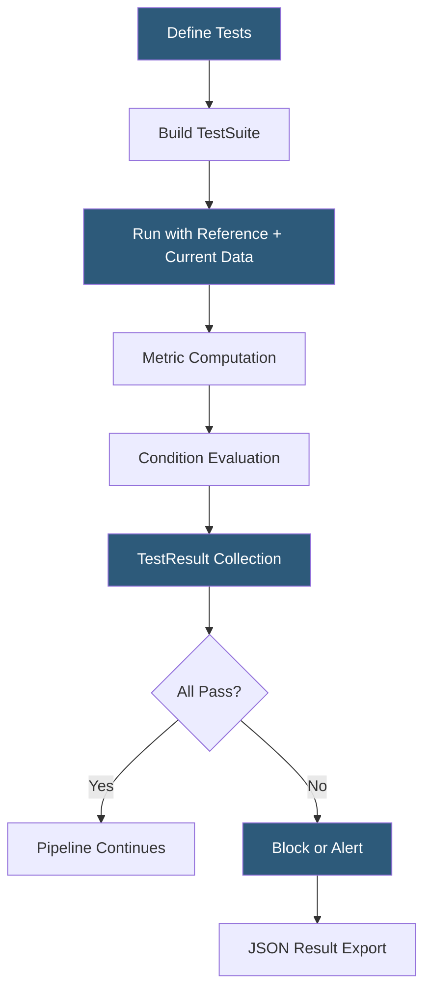

**Category:** AI Model Monitoring & Observability
**Difficulty:** Intermediate
**Reading time:** 5 min read

---

Evidently Test Suites provide a programmatic assertion framework for validating ML data and model quality as executable code. They transform monitoring metrics into pass/fail quality gates that integrate directly into CI/CD pipelines, data orchestration workflows, and automated retraining triggers.

- **Test** — a single quality assertion with a condition, metric, and expected outcome (e.g., mean feature drift PSI below 0.1)
- **TestSuite** — container grouping multiple Tests into a coherent validation context
- **TestResult** — output object containing test status (pass/fail/warning), computed metric value, and descriptive explanation
- **Condition** — logical operator expression comparing a computed metric to a threshold (lt, gt, eq, lte, gte, is_in, not_in)
- **Auto-generated test** — Evidently's capability to automatically generate sensible default tests by inspecting reference data statistics
- **Failure mode** — configurable behavior when a test fails: raise exception (blocking), warn (non-blocking), or log result
- **JSON output** — machine-readable test result format enabling downstream pipeline logic based on specific test failures

Evidently Test Suites are instantiated as Python objects containing a list of Test instances. Each Test encapsulates a specific quality assertion: `TestColumnDrift(column_name="age")` checks whether the "age" column has drifted above Evidently's default threshold. Tests accept optional condition overrides: `TestColumnDrift(column_name="age", stattest_threshold=0.05)` tightens the threshold for a particularly sensitive feature.

When `.run()` is called, Evidently computes all metrics in a single pass over the data, then evaluates each test's condition against the computed values. Results are accessible as a structured object or exportable to JSON for downstream consumption. The JSON format includes per-test status, computed value, threshold, and a human-readable description, enabling alert systems to generate contextualized notifications.

Auto-generation mode reduces configuration burden: calling `TestSuite(tests=[DataDriftTestPreset()])` automatically creates individual drift tests for every feature in the reference dataset, using Evidently's heuristics to select the appropriate statistical test per column type (numeric vs categorical) and set initial thresholds based on reference data variance.

Integration with data orchestration platforms follows the exit code convention: failed test suites raise exceptions that mark Airflow tasks or Prefect flows as failed, blocking downstream pipeline stages. This enables automated deployment blocking when training data quality checks fail before a model retraining run begins.

Evidently Test Suites also serve as model acceptance tests: a new model candidate's predictions on a held-out dataset must pass performance threshold tests before the model is registered to production. This gates production promotion on quantitative quality evidence.

- CI/CD gate blocking model deployment when feature drift exceeds acceptable thresholds
- Automated Airflow task validating upstream data quality before triggering model retraining
- Model acceptance test suite requiring new models to outperform a baseline on F1 and calibration
- Nightly data pipeline health check running across all ML feature columns
- Pull request validation in a data science repository checking that model changes don't degrade quality metrics

| Advantage | Disadvantage |
|-----------|--------------|
| Tests-as-code integrate naturally with version control and code review workflows | Threshold calibration requires domain expertise and iterative refinement |
| Auto-generated tests reduce initial configuration effort | Auto-generated thresholds may not reflect domain-specific data contract requirements |
| JSON output enables flexible downstream pipeline logic beyond simple pass/fail | Complex multi-dataset test suites require careful orchestration to run efficiently |
| Open-source with no platform dependency for basic test suite usage | Production-scale scheduling and persistence requires Evidently Cloud or custom infrastructure |

- [Evidently AI Monitoring](evidently-ai-monitoring.md)
- [Data Drift Analysis](data-drift-analysis.md)
- [Whylabs Data Quality Monitoring](whylabs-data-quality-monitoring.md)

---
*Part of the [AI Model Monitoring & Observability](index.md) category · [Back to Master Index](../../index.md)*
