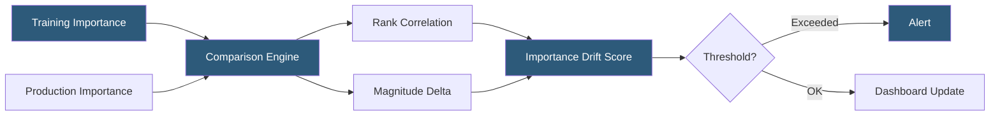

**Category:** AI Model Monitoring & Observability
**Difficulty:** Intermediate
**Reading time:** 6 min read

---

Feature importance tracking monitors changes in which features most influence model predictions over time in production. When features that were critical during training become less predictive in production—or vice versa—this signals concept drift, data quality issues, or distribution shifts that may require model retraining before accuracy metrics degrade.

- **Feature importance drift** — change in the relative contribution of features to model predictions between training time and production
- **Permutation importance** — importance metric measuring accuracy degradation when a feature's values are randomly shuffled, available for any model type
- **Gain-based importance** — tree-model importance metric measuring the average improvement in split quality for splits using each feature
- **SHAP-based importance** — mean absolute SHAP value per feature, providing a consistent, consistent importance ranking
- **Importance rank stability** — how consistently features maintain their importance ranking across monitoring windows
- **Spurious correlation** — a feature that was important at training time due to historical correlation with the target, which loses predictive power as the correlation dissolves
- **Feature attribution drift monitor** — automated monitoring system comparing production feature importance against training baseline

Feature importance tracking requires computing importance values from production prediction data periodically, then comparing against training-time importance. For tree-based models, TreeSHAP importance (mean absolute SHAP) is the preferred method due to its consistency and exact computation. For neural networks or black-box models, permutation importance on a recent labeled production window is more practical.

Rank correlation analysis uses Spearman's rank correlation coefficient to measure how consistently features maintain their relative importance ordering between training and production. A correlation of 1.0 indicates identical importance ranking; values below 0.7-0.8 signal meaningful importance reorganization warranting investigation.

Magnitude tracking monitors not just ranking but the absolute contribution of top features. A feature dropping from 35% of prediction variance to 15% is more concerning than a marginal feature changing from 2% to 3%, even if the rank correlation is unchanged.

Feature importance drift is an early signal of concept drift. A temporal pattern seen across multiple model types is: (1) input data drift begins, (2) feature importance shifts as the model's learned relationships become misaligned, (3) accuracy degrades. Detecting importance drift in step 2 enables earlier retraining before users experience step 3.

For models where ground truth labels are significantly delayed (medical outcomes, long-term predictions), importance tracking through SHAP on unlabeled production data provides a leading indicator otherwise unavailable. Importance shifts can be detected without labels, unlike accuracy-based concept drift detection.

SageMaker Clarify, Azure ML Responsible AI, and Fiddler AI all support scheduled feature attribution drift monitoring, computing SHAP values on production samples and comparing against training-time attribution baselines automatically.

- Early concept drift detection for a financial risk model when macroeconomic feature importance reorganizes
- Detecting that a historically important feature is now arriving as null in production (pipeline failure)
- Validating that a model update hasn't unexpectedly changed which features drive predictions
- Identifying proxy features that gained spurious importance during training but lose predictive power in production
- Compliance monitoring for models where regulatory requirements specify that certain features must not dominate predictions

| Advantage | Disadvantage |
|-----------|--------------|
| Leading indicator of concept drift available before accuracy metrics degrade | Requires SHAP or permutation importance computation which is computationally expensive at scale |
| Detects importance shifts without ground truth labels in delayed-label scenarios | Importance values from different computation methods (SHAP vs gain vs permutation) are not directly comparable |
| Rank correlation provides an intuitive importance stability metric | Correlated features complicate interpretation: dropping one correlated feature elevates another artificially |
| Automated monitoring with platforms like Clarify reduces engineering effort | Defining meaningful importance drift thresholds requires domain knowledge of expected variance |

- [SHAP Value Calculation](shap-value-calculation.md)
- [LIME Explanations](lime-explanations.md)
- [Model Explainability Tools](model-explainability-tools.md)

---
*Part of the [AI Model Monitoring & Observability](index.md) category · [Back to Master Index](../../index.md)*
