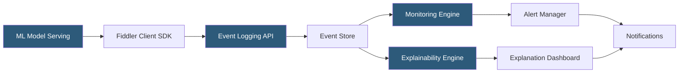

**Category:** AI Model Monitoring & Observability
**Difficulty:** Intermediate
**Reading time:** 6 min read

---

Fiddler AI is an enterprise observability platform that combines model performance monitoring, drift detection, and explainability into a unified system. It is distinguished by its native integration of explainability methods (SHAP, surrogate models) directly into the monitoring workflow, enabling practitioners to understand not just that a model is degrading but why.

- **Fiddler Model Performance Management (MPM)** — framework for tracking ML model KPIs across the full production lifecycle
- **Surrogate model** — interpretable proxy model trained to approximate a complex model's behavior, used to generate feature importance explanations
- **SHAP integration** — built-in Shapley value computation for explaining individual predictions at the monitoring layer
- **Alert rule** — configured condition combining metric, threshold, evaluation window, and notification target
- **Segment monitoring** — disaggregated performance tracking across feature-defined cohorts to detect fairness regressions
- **What-if analysis** — interactive tool for simulating the effect of feature value changes on model predictions
- **Custom metric** — user-defined calculation applied to logged prediction data for business-specific monitoring needs

Fiddler's core integration path uses the `fiddler-client` SDK to publish prediction events containing model inputs, outputs, and optional metadata to Fiddler's event ingestion API. Alternatively, batch uploads via S3 or direct database connectors enable offline logging for models where real-time instrumentation isn't feasible.

The platform's differentiating capability is its integrated explainability layer. When a drift alert fires, engineers can immediately drill into explanation-enriched views showing which features drove the score change. Fiddler pre-computes approximate SHAP values at logging time using a background computation service, making per-prediction explanations available in the monitoring dashboard without on-demand recalculation latency.

For regulated industries, Fiddler's segment monitoring enforces fairness constraints. Users configure demographic segments (age bracket, geography, product type) and set differential performance thresholds—alerting when the accuracy gap between segments exceeds a defined tolerance. This operationalizes fairness monitoring as part of the standard ML operational workflow.

What-if analysis allows operators to test model sensitivity interactively: changing a feature value in the UI generates a real-time prediction from the deployed model, showing how predictions shift. This is particularly valuable for investigating borderline cases flagged during monitoring investigations.

Fiddler integrates with CI/CD pipelines through a model registry API, enabling pre-production validation where new model candidates must pass defined quality and fairness thresholds before receiving production traffic.

- Financial services firms monitoring credit scoring models for both accuracy and demographic fairness simultaneously
- Investigating an alert on prediction drift by examining SHAP value shifts across flagged predictions
- Pre-production model validation gates that enforce performance and fairness standards before deployment
- Customer service teams using what-if analysis to understand edge cases reported by end users
- Compliance reporting using disaggregated performance metrics across protected characteristic cohorts

| Advantage | Disadvantage |
|-----------|--------------|
| Native explainability integration links drift detection to causal analysis | SHAP pre-computation adds infrastructure cost and latency for large-scale deployments |
| Fairness monitoring operationalizes regulatory compliance requirements | Enterprise pricing and complexity may exceed requirements for smaller teams |
| What-if analysis bridges the gap between monitoring and model investigation | Surrogate models approximate but don't perfectly replicate complex model behavior |
| Integrated SDK reduces monitoring setup to a few lines of instrumentation code | Full-featured deployment requires dedicated Fiddler infrastructure or SaaS subscription |

- [Fiddler Explainability Platform](fiddler-explainability-platform.md)
- [Model Explainability Tools](model-explainability-tools.md)
- [Arize AI Observability Platform](arize-ai-observability-platform.md)

---
*Part of the [AI Model Monitoring & Observability](index.md) category · [Back to Master Index](../../index.md)*
