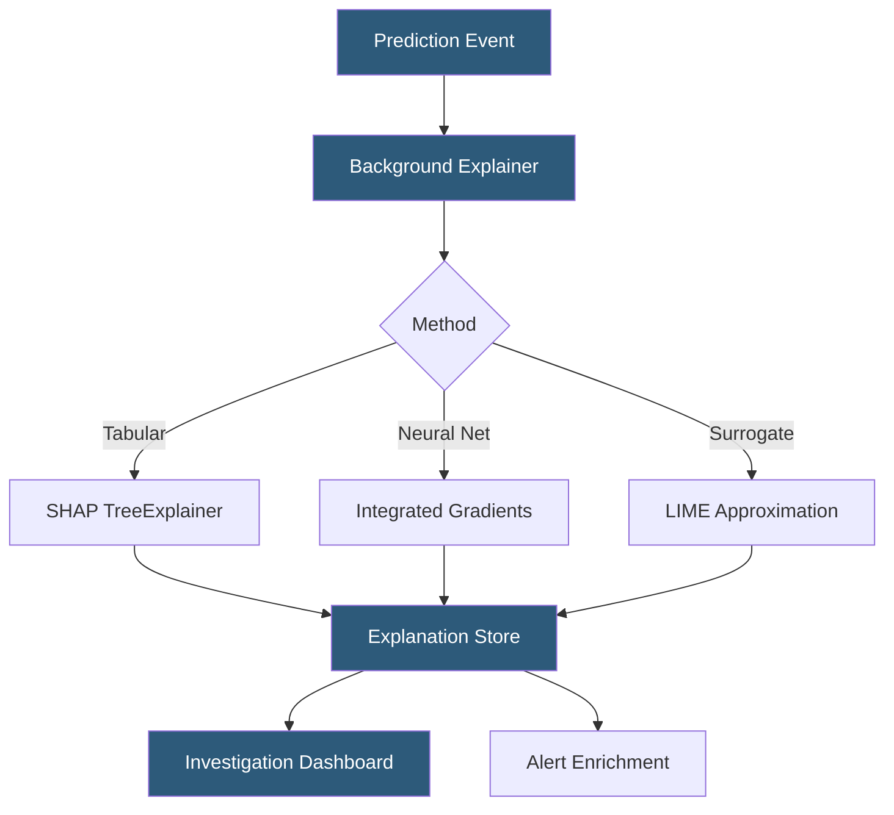

**Category:** AI Model Monitoring & Observability
**Difficulty:** Advanced
**Reading time:** 7 min read

---

Fiddler's explainability platform provides methods for interpreting individual model predictions and aggregate model behavior in production. It moves explainability from a pre-deployment analysis tool to a continuous operational capability, surfacing interpretation alongside monitoring metrics to accelerate incident investigation and build stakeholder trust.

- **Global explainability** — feature importance analysis over the full dataset showing which features drive model behavior on average
- **Local explainability** — per-prediction explanation showing which specific feature values drove a particular output
- **SHAP (Shapley Additive Explanations)** — game-theory-based method attributing prediction contributions to individual features with consistency and local accuracy guarantees
- **Integrated Gradients** — gradient-based attribution method applicable to neural networks, particularly for text and image inputs
- **Partial Dependence Plot (PDP)** — visualization of how changing a single feature's value affects model predictions while averaging over other features
- **Individual Conditional Expectation (ICE)** — per-instance variant of PDP showing prediction change curves for individual examples
- **Counterfactual explanation** — minimal feature change required to flip a prediction to a different class, useful for actionable recourse

Fiddler's explainability architecture separates explanation computation from the serving path to avoid adding latency to production inference. The platform runs a background explainability service that consumes logged prediction events from the event queue and asynchronously generates SHAP values using the appropriate algorithm variant based on model type.

For tree-based models (XGBoost, LightGBM, random forests), Fiddler uses TreeSHAP—an exact, polynomial-time SHAP algorithm that produces consistent attributions without sampling approximation. For neural networks, it applies Integrated Gradients by computing gradients along the path from a baseline input (typically zeros or mean values) to the actual input, accumulating attribution contributions across this path.

Global explainability aggregates local SHAP values across a configurable time window, producing feature importance rankings that reflect actual production behavior rather than training-time importance. This captures importance drift—cases where a feature's real-world influence diverges from its training-time importance—which often precedes accuracy degradation.

For regulated use cases, Fiddler generates counterfactual explanations: the minimum feature perturbation needed to change the model's decision. These actionable explanations enable human-facing justifications for adverse decisions (loan denials, content flagging) that comply with right-to-explanation requirements under GDPR Article 22 and similar regulations.

Explanation data is stored alongside prediction records, enabling retrospective investigation. When a monitoring alert fires, engineers drill through the alert into explanation-enriched prediction samples from the alert window, directly seeing which feature patterns characterize the flagged population.

- Generating right-to-explanation justifications for adverse automated decisions in lending or insurance
- Investigating why a recommendation model's click-through rate dropped by examining SHAP value shifts
- Auditing a hiring model for disparate feature influence across demographic groups
- Debugging a newly deployed model version whose accuracy regressed by analyzing which features changed in importance
- Building trust with non-technical stakeholders by visualizing feature contribution waterfall charts

| Advantage | Disadvantage |
|-----------|--------------|
| Background computation avoids adding explanation latency to production serving | SHAP computation can be expensive for large feature sets, requiring compute allocation |
| TreeSHAP provides exact attributions for tree models without sampling approximation | Neural network explanations (Integrated Gradients) require baseline selection which affects results |
| Counterfactuals provide actionable recourse meeting regulatory right-to-explanation requirements | Surrogate-based approximation methods for complex models introduce explanation fidelity tradeoffs |
| Global explanations from production data reflect real usage patterns not just training distribution | Explanation methods may disagree, requiring practitioner judgment on which to trust for a given context |

- [Fiddler AI Observability](fiddler-ai-observability.md)
- [Model Explainability Tools](model-explainability-tools.md)
- [SHAP Value Calculation](shap-value-calculation.md)

---
*Part of the [AI Model Monitoring & Observability](index.md) category · [Back to Master Index](../../index.md)*
