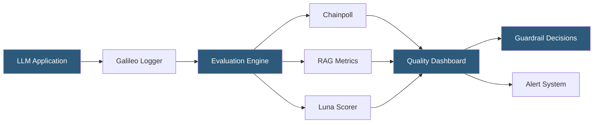

**Category:** AI Model Monitoring & Observability
**Difficulty:** Advanced
**Reading time:** 6 min read

---

Galileo is an AI quality platform specializing in LLM evaluation and observability, with particular strength in identifying hallucinations, factual inconsistencies, and response quality degradation in generative AI applications. It provides automated guardrails and evaluation pipelines that integrate into the full LLM development and production lifecycle.

- **Chainpoll** — Galileo's hallucination detection algorithm using repeated LLM sampling to estimate response reliability
- **RAG quality metrics** — evaluation of retrieval-augmented generation systems measuring context adherence, completeness, and chunk attribution
- **Guardrails** — real-time quality gates that evaluate LLM responses before returning them to end users
- **Prompt evaluation** — systematic testing of prompt templates across test datasets to measure response quality before deployment
- **Luna** — Galileo's small, purpose-built evaluation model providing quality scores at lower cost than using frontier models as judges
- **Hallucination Index** — composite score measuring factual inconsistency between generated responses and provided context
- **Chunk attribution** — RAG-specific metric measuring which retrieved document chunks contributed to generated responses

Galileo addresses the unique challenge of monitoring generative AI systems where outputs are unstructured text and traditional classification metrics (accuracy, precision, recall) don't apply directly. The platform instruments LLM applications through a logging callback that captures prompts, retrieved context (for RAG applications), generated responses, and any user feedback signals.

Chainpoll, Galileo's proprietary hallucination detection method, works by sampling multiple responses from the LLM for the same prompt and computing consistency across the sample. Responses that vary significantly across samples indicate low model confidence and high hallucination risk. Responses that remain consistent across samples are scored as more reliable. This method outperforms single-pass LLM-as-judge approaches on hallucination benchmarks.

For RAG systems, Galileo computes additional metrics specific to retrieval quality. Context adherence measures whether the generated response is grounded in the retrieved documents or invents information beyond what retrieval provides. Context relevance measures whether retrieved chunks are relevant to the user query. Chunk attribution traces which specific retrieved passages contributed to each portion of the generated response, enabling diagnosis of retrieval pipeline failures.

The Luna evaluation model enables scalable quality scoring without requiring expensive frontier model API calls for every production inference. Luna produces scores correlated with GPT-4-judge ratings at a fraction of the cost, making continuous production monitoring economically viable.

Guardrails deploy in the serving path: Galileo evaluates each response before it reaches the end user, blocking or modifying responses that fail quality thresholds. This is particularly valuable in production RAG systems where context-inconsistent responses can propagate misinformation.

- Real-time hallucination detection in a customer-facing AI assistant to prevent misinformation
- Evaluating prompt template changes across a test suite before production deployment
- Diagnosing RAG pipeline quality issues by identifying which retrieval chunks have low relevance scores
- Monitoring LLM application quality regressions after underlying model updates
- A/B testing between model versions on response quality metrics before full traffic migration

| Advantage | Disadvantage |
|-----------|--------------|
| Chainpoll hallucination detection outperforms single-pass judge methods | Multi-sample hallucination detection increases latency and API cost per request |
| RAG-specific metrics provide actionable diagnosis for retrieval pipeline issues | Luna evaluation model accuracy may not match frontier model judges for specialized domains |
| Guardrails prevent poor-quality responses from reaching end users in production | Guardrail false positives may block valid responses, degrading user experience |
| Luna reduces evaluation cost for continuous production monitoring | Platform pricing scales with evaluation volume; high-traffic applications may have significant cost |

- [LangSmith LLM Monitoring](langsmith-llm-monitoring.md)
- [LangFuse LLM Observability](langfuse-llm-observability.md)
- [Mona Labs Monitoring](mona-labs-monitoring.md)

---
*Part of the [AI Model Monitoring & Observability](index.md) category · [Back to Master Index](../../index.md)*
