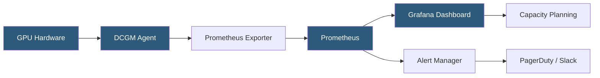

**Category:** AI Model Monitoring & Observability
**Difficulty:** Intermediate
**Reading time:** 6 min read

---

GPU utilization monitoring tracks the occupancy and efficiency of GPU resources in AI model serving environments, enabling capacity planning, cost optimization, and performance bottleneck identification. Low GPU utilization indicates wasted infrastructure spend, while high utilization signals capacity constraints that may degrade inference latency.

- **GPU utilization percentage** — fraction of time the GPU compute units (CUDA cores or tensor cores) are actively executing kernels
- **GPU memory utilization** — fraction of GPU VRAM in use; critical for large model serving where OOM errors cause serving failures
- **SM (Streaming Multiprocessor) occupancy** — ratio of active warps to maximum possible active warps per SM, measuring how efficiently the GPU pipeline is filled
- **DCGM (Datacenter GPU Manager)** — NVIDIA's tool for comprehensive GPU health and utilization monitoring in data center deployments
- **nvitop / nvidia-smi** — command-line GPU monitoring utilities providing real-time utilization, memory, and process information
- **Tensor core utilization** — specialized metric for AI workloads measuring how much of the available tensor operation throughput is being used
- **Multi-Instance GPU (MIG) utilization** — utilization metrics for individual MIG partitions when A100/H100 GPUs are partitioned for multi-tenant serving

GPU utilization monitoring typically uses NVIDIA's DCGM-exporter (Datacenter GPU Manager) deployed as a DaemonSet in Kubernetes environments. DCGM collects GPU metrics at configurable intervals (default: 30 seconds) through the DCGM API and exposes them as a Prometheus metrics endpoint. These are scraped into Prometheus and visualized in Grafana dashboards.

Key metrics to track include DCGM_FI_DEV_GPU_UTIL (compute utilization %), DCGM_FI_DEV_MEM_COPY_UTIL (memory bandwidth utilization %), DCGM_FI_DEV_FB_USED (framebuffer/VRAM used in MB), and DCGM_FI_DEV_POWER_USAGE (power draw in watts). Temperature monitoring (DCGM_FI_DEV_GPU_TEMP) is critical for hardware health; GPUs throttle at thermal limits.

For AI inference workloads, GPU utilization is often bursty rather than continuous—request arrival patterns create utilization spikes between idle periods. Batch aggregation strategies (dynamic batching, continuous batching for LLMs) increase average utilization by consolidating multiple requests into single GPU kernel executions. The relationship between utilization and latency follows a hockey stick curve: latency remains relatively flat until utilization approaches 85-90%, then increases sharply.

Memory utilization requires particular attention for large model serving. An H100 80GB GPU serving a 70B parameter model at FP16 precision is already 87.5% memory occupied just by model weights, leaving minimal headroom for KV cache during inference. Memory monitoring alerts firing above 90% trigger investigation of batch size limits or model quantization.

Cloud platforms expose GPU utilization through native monitoring: AWS CloudWatch GPU metrics for EC2 GPU instances, GCP Cloud Monitoring for Compute Engine GPU instances, and Azure Monitor for NDv4/NC series VMs. These integrate with existing operational monitoring stacks.

- Capacity planning: determining when to add GPU instances based on utilization trend approaching saturation
- Cost optimization: identifying consistently underutilized GPU instances that could be resized or consolidated
- Detecting GPU memory pressure that precedes OOM errors and inference failures
- Performance tuning: correlating batch size changes with GPU utilization to optimize throughput
- Multi-tenant MIG allocation monitoring ensuring fair resource distribution across serving workloads

| Advantage | Disadvantage |
|-----------|--------------|
| DCGM provides comprehensive GPU health and utilization metrics through a standard Prometheus interface | DCGM setup requires elevated privileges and container security context adjustments in Kubernetes |
| Correlation with latency metrics enables proactive capacity scaling before user impact | GPU utilization metrics require GPU-aware monitoring tooling; standard APM tools often lack GPU support |
| Memory monitoring prevents OOM failures through proactive threshold alerting | Bursty inference workloads make average utilization metrics misleading for capacity planning |
| Cloud-native metrics integration reduces custom monitoring infrastructure for hosted GPU instances | Multi-GPU and MIG environments require careful metric aggregation to avoid misleading averages |

- [Inference Cost Monitoring](inference-cost-monitoring.md)
- [Real-time Monitoring Dashboards](real-time-monitoring-dashboards.md)
- [Model Latency Tracking](model-latency-tracking.md)

---
*Part of the [AI Model Monitoring & Observability](index.md) category · [Back to Master Index](../../index.md)*
