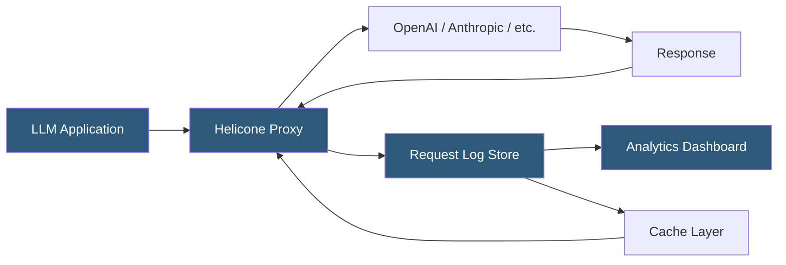

**Category:** AI Model Monitoring & Observability
**Difficulty:** Beginner
**Reading time:** 5 min read

---

Helicone is an LLM observability platform that acts as a proxy layer between applications and LLM provider APIs. It captures all request-response pairs transparently, providing cost analytics, latency monitoring, and request caching without requiring application-level SDK instrumentation.

- **Proxy architecture** — Helicone routes API calls through its infrastructure, capturing telemetry without SDK changes in application code
- **Request caching** — Helicone caches identical prompt responses, reducing both cost and latency for repeated queries
- **Cost analytics** — per-request and aggregated cost tracking across models and providers normalized to common units
- **Rate limiting** — request throttling rules applied at the Helicone proxy layer to enforce usage budgets per user or API key
- **User tracking** — request attribution to end users via custom headers, enabling per-user usage and cost analysis
- **Prompt template management** — variable extraction from requests to associate requests with named prompt templates
- **Webhooks** — callbacks triggered on each request for custom processing, alerting, or data pipelines

Helicone's proxy approach is its primary differentiator: applications change only their API base URL (e.g., from `api.openai.com` to `oai.helicone.ai`) and add a Helicone API key header. All existing OpenAI-compatible API calls route through Helicone's proxy, which logs request metadata, forwards the request to the provider, logs the response with token counts and cost, and returns the response to the caller.

This proxy interception requires zero SDK changes and works with any programming language or framework. Applications using raw HTTP, the OpenAI Python SDK, LangChain, or any other tool that accepts a base URL override work without modification.

Cost analytics aggregate per-request token usage and compute costs using Helicone's pricing database (regularly updated with provider pricing changes). Teams can filter costs by time range, model, user, application environment, and custom property tags attached via request headers. Cost dashboards enable identification of expensive prompt patterns, model cost comparisons, and budget burn-rate tracking.

Request caching is particularly valuable for development environments and applications with repetitive query patterns. Helicone can cache identical prompts and return cached responses, eliminating provider API costs for repeated requests. Cache hit rates for test suites often reach 80-90%, dramatically reducing development iteration costs.

User-level tracking uses a `Helicone-User-Id` header to attribute each request to an end user identifier. This enables per-user cost analysis and rate limiting—preventing individual users from consuming disproportionate API quota in multi-tenant applications.

- Instant LLM cost visibility for a startup with no existing monitoring infrastructure
- Development environment request caching reducing test suite API costs by 80%+
- Per-user cost attribution and rate limiting in a SaaS product built on LLM APIs
- Latency tracking identifying which models and prompt lengths cause unacceptable response times
- Webhook-based custom alerting when hourly API spend exceeds a defined budget threshold

| Advantage | Disadvantage |
|-----------|--------------|
| Zero application code changes via proxy base URL swap | Proxy adds network hop, increasing latency by typically 10-30ms |
| Request caching directly reduces API costs for repetitive patterns | Proxy is a potential single point of failure for LLM-dependent applications |
| Works with any language or framework accepting base URL configuration | Full request payloads routed through Helicone; data privacy requires trusting the vendor |
| Immediate cost and usage visibility without engineering investment | Less granular trace hierarchy than SDK-based tools for complex chain debugging |

- [LangSmith LLM Monitoring](langsmith-llm-monitoring.md)
- [PromptLayer LLM Tracking](promptlayer-llm-tracking.md)
- [Inference Cost Monitoring](inference-cost-monitoring.md)

---
*Part of the [AI Model Monitoring & Observability](index.md) category · [Back to Master Index](../../index.md)*
