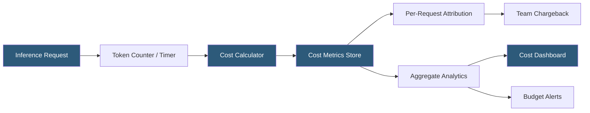

**Category:** AI Model Monitoring & Observability
**Difficulty:** Intermediate
**Reading time:** 6 min read

---

Inference cost monitoring tracks and analyzes the computational and financial expenditure of serving ML models in production. With LLM API costs potentially scaling rapidly with usage, and GPU infrastructure costs for self-hosted models representing significant operational expenses, cost observability is now a first-class MLOps concern.

- **Cost per inference** — the total financial cost (API fees or infrastructure allocation) attributable to a single model prediction request
- **Token cost** — for LLM APIs, the per-token price multiplied by input and output token counts for each request
- **GPU hour cost** — infrastructure cost for self-hosted models calculated as GPU utilization fraction multiplied by GPU-hour pricing
- **Cost per unit output** — business-normalized cost metric (cost per recommendation served, cost per document processed) enabling ROI analysis
- **Cost anomaly** — sudden spike in per-request cost indicating prompt length growth, model upgrade, or pricing change
- **Cost attribution** — allocation of inference costs to specific features, teams, or user segments for chargeback and accountability
- **Model cost efficiency** — ratio of output quality (accuracy, user satisfaction) to inference cost, used for model selection decisions

For API-based LLM deployments, cost monitoring captures token usage from provider API responses. OpenAI, Anthropic, and other providers return token counts (input tokens, output tokens, cached tokens) in response metadata. Multiplying these counts by the current model pricing produces per-request cost. Helicone, LangSmith, and LangFuse all capture this metadata and aggregate it into cost analytics.

For self-hosted models, cost calculation is based on GPU resource allocation. GPU time attributed to each inference request is computed from request duration and GPU count. This is multiplied by GPU pricing from the cloud provider's billing API (EC2 GPU instance rates, GCP Accelerator rates) or by an internal chargeback rate for on-premises hardware.

Cost attribution adds dimension: tagging each request with team ID, product feature, user tier, or experiment variant enables aggregating costs per business unit. This enables data-driven decisions about which features justify their inference cost and which should be optimized or deprecated.

Cost anomaly detection applies statistical methods to the per-request cost time series. Cost spikes may indicate prompt length growth (users sending increasingly large contexts), a model configuration change that increased output verbosity, or a provider pricing change. Anomaly alerts route to the engineering team responsible for the affected service.

Budget alerting implements hard spend limits: daily, weekly, and monthly budget thresholds trigger notifications when 50%, 80%, and 100% of budget is consumed. For multi-tenant SaaS applications, per-user or per-account cost caps prevent any single user from exhausting shared inference budget.

Cost efficiency optimization uses monitoring data to identify optimization opportunities: requests with long context windows that could use context compression, repeated identical prompts that could be cached, or tasks using expensive frontier models that could be served by cheaper smaller models.

- LLM cost attribution across product features to identify which features justify their inference spend
- Budget alerts preventing surprise monthly bills from unexpected usage spikes
- Cost efficiency comparison between two model variants during an A/B test
- Identifying user behaviors generating disproportionate inference costs for rate limiting or pricing tier design
- Multi-cloud cost comparison to inform model hosting platform selection decisions

| Advantage | Disadvantage |
|-----------|--------------|
| Per-request cost attribution enables precise accountability for inference spend | Token cost calculation depends on accurate provider pricing data that requires maintenance |
| Budget alerts prevent runaway spending from usage spikes or bugs | GPU cost attribution for shared inference servers requires utilization metering per request |
| Cost efficiency metrics enable ROI-based model selection decisions | Cost monitoring for self-hosted models requires building custom infrastructure cost allocation |
| Anomaly detection identifies unexpected cost drivers before they become significant | Cost aggregation with fine-grained attribution generates high metadata volume |

- [Model Latency Tracking](model-latency-tracking.md)
- [GPU Utilization Monitoring](gpu-utilization-monitoring.md)
- [Real-time Monitoring Dashboards](real-time-monitoring-dashboards.md)

---
*Part of the [AI Model Monitoring & Observability](index.md) category · [Back to Master Index](../../index.md)*
