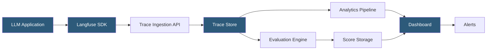

**Category:** AI Model Monitoring & Observability
**Difficulty:** Intermediate
**Reading time:** 6 min read

---

Langfuse is an open-source LLM engineering platform providing tracing, evaluation, and prompt management for AI applications. Its open-source nature and self-hostable architecture make it particularly attractive for organizations with data privacy requirements or those building LLM applications outside the LangChain ecosystem.

- **Trace** — hierarchical record of an LLM application execution, containing nested spans for each processing step
- **Span** — individual operation within a trace (LLM call, retrieval, post-processing) with timing, input, and output data
- **Generation** — LLM-specific span type capturing model name, prompt tokens, completion tokens, and cost information
- **Score** — evaluation result attached to a trace or span, recording quality ratings from automated evaluators or human reviewers
- **Prompt** — versioned template registered in Langfuse and fetched at runtime, enabling centralized prompt management
- **Session** — grouping of related traces representing a multi-turn conversation or user session
- **Observation** — generic span type for non-LLM operations within a trace (database queries, API calls, computation steps)

Langfuse provides SDKs for Python, TypeScript/JavaScript, and integrations with LangChain, LlamaIndex, OpenAI, and Anthropic SDKs. The Python SDK uses a decorator pattern (`@observe`) to instrument functions automatically, or an explicit context manager API for fine-grained control over trace structure.

Trace ingestion is asynchronous by default: SDK calls queue trace events and flush them in background threads, adding minimal latency to the serving path. The Langfuse server aggregates incoming events into trace hierarchies using parent-span identifiers included in each event payload.

Self-hosting is a key capability: Langfuse can be deployed as a Docker Compose stack (Postgres + Redis + application server) on any cloud provider or on-premises infrastructure. This enables full data sovereignty—trace data never leaves the organization's environment. The Langfuse Cloud SaaS option is available for teams prioritizing operational simplicity over data residency requirements.

The evaluation framework accepts evaluation functions that receive trace data and return Score objects. Evaluators run as asynchronous background jobs, computing quality metrics without affecting production serving. Built-in evaluation integrations include OpenAI and Anthropic LLM judges, as well as model-based classifiers for toxicity and factuality.

Prompt management in Langfuse allows teams to define prompt templates with variables, version them, and fetch them at runtime via the SDK. This separates prompt iteration from application code deployment—updating a prompt in the Langfuse UI takes effect immediately in production without redeploying the application.

- Self-hosting LLM observability for a healthcare application where trace data must stay on-premises
- Tracing multi-turn conversation sessions to diagnose context degradation over long interactions
- Centralized prompt management enabling non-engineers to update prompt templates without code deployments
- Cost monitoring and attribution across different LLM providers and models in a multi-provider application
- Human-in-the-loop annotation workflows where domain experts review and score LLM outputs

| Advantage | Disadvantage |
|-----------|--------------|
| Open-source with self-hosting enables full data sovereignty | Self-hosted deployment requires infrastructure management and maintenance overhead |
| Framework-agnostic SDK works with any LLM provider or orchestration framework | Feature set may lag behind specialized commercial platforms in some areas |
| Prompt management decouples prompt iteration from application code deployments | High-volume applications generate large trace volumes requiring storage planning |
| Session tracking enables multi-turn conversation analysis | Cost attribution accuracy depends on model providers exposing token usage in responses |

- [LangSmith LLM Monitoring](langsmith-llm-monitoring.md)
- [Helicone LLM Monitoring](helicone-llm-monitoring.md)
- [PromptLayer LLM Tracking](promptlayer-llm-tracking.md)

---
*Part of the [AI Model Monitoring & Observability](index.md) category · [Back to Master Index](../../index.md)*
