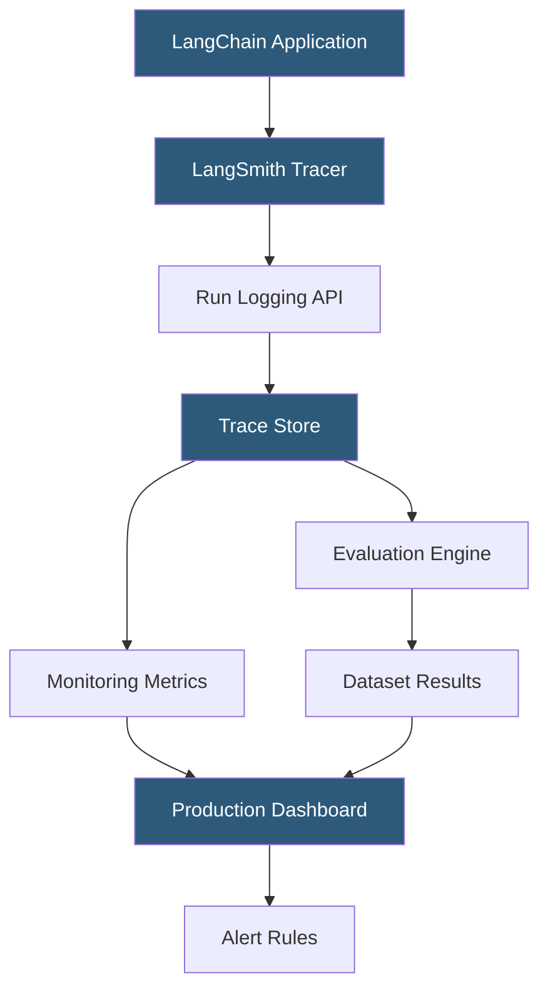

**Category:** AI Model Monitoring & Observability
**Difficulty:** Intermediate
**Reading time:** 6 min read

---

LangSmith is LangChain's observability and evaluation platform for LLM applications, providing full trace visibility into chain and agent executions, automated evaluation pipelines, and production monitoring dashboards. It is the most widely adopted LLM-specific observability tool due to its native integration with the LangChain ecosystem.

- **Trace** — complete execution record of a LangChain chain or agent run, including all intermediate LLM calls, tool invocations, and data transformations
- **Run** — individual component execution within a trace (a single LLM call, a retriever lookup, a tool call)
- **Dataset** — curated collection of input-output pairs used for systematic evaluation of LLM applications
- **Evaluator** — function or LLM-judge that scores a run's output against a reference or defined criteria
- **Prompt hub** — versioned prompt template registry enabling managed prompt iteration and deployment
- **Feedback** — user or automated quality signal attached to runs (thumbs up/down, category labels, numeric scores)
- **Playground** — interactive interface for testing prompt templates and chain configurations against live models

LangSmith integrates through environment variable configuration: setting `LANGCHAIN_TRACING_V2=true` and `LANGCHAIN_API_KEY` automatically instruments all LangChain components without code changes. Each chain execution generates a hierarchical trace: the root run contains the user's input, child runs represent each component execution (LLM call, retriever, tool), and leaf runs capture the lowest-level operations.

Traces record latency, token counts, model name, prompt template, raw inputs and outputs, and error information for each run. This granularity enables diagnosis of performance issues at the component level: if end-to-end latency is high, the trace visualizer pinpoints which component is the bottleneck.

Evaluation workflows in LangSmith involve creating a Dataset of test cases (input, optional reference output pairs) and running an evaluator function against them. Built-in evaluators use GPT-4 as a judge to score outputs on criteria like correctness, helpfulness, and harmlessness. Custom evaluators accept a Python function that returns a numeric score. Results are stored as annotated run records, enabling comparison across prompt versions, model configurations, or dates.

Production monitoring dashboards aggregate run metadata over time: tracking error rates, average latency, token usage costs, and user feedback rates. Feedback collected from application users (thumbs up/down buttons, satisfaction ratings) integrates directly into LangSmith as attached feedback records, enabling human-in-the-loop quality monitoring.

The Prompt Hub provides versioned prompt template management with diff visualization between versions, enabling systematic prompt engineering with full change history.

- Debugging a LangChain agent that occasionally fails to complete multi-step tasks
- Running systematic evaluation on a QA chain using a curated test dataset before deployment
- Monitoring production LLM application latency and cost metrics over time
- Collecting user feedback from a chatbot and correlating it with run traces for investigation
- Managing prompt template versions across a team with review workflows before production promotion

| Advantage | Disadvantage |
|-----------|--------------|
| Zero-code instrumentation through environment variables reduces integration friction | Tightly coupled to LangChain; non-LangChain applications require manual SDK integration |
| Full trace hierarchy enables component-level performance diagnosis | Full trace storage can accumulate significant data volume in high-traffic applications |
| Built-in LLM judges reduce evaluation setup time | LLM-as-judge evaluation introduces its own model biases and costs |
| Prompt Hub enables systematic prompt versioning and team collaboration | LangSmith Cloud pricing scales with team size and trace volume |

- [LangFuse LLM Observability](langfuse-llm-observability.md)
- [Helicone LLM Monitoring](helicone-llm-monitoring.md)
- [Galileo Observability](galileo-observability.md)

---
*Part of the [AI Model Monitoring & Observability](index.md) category · [Back to Master Index](../../index.md)*
