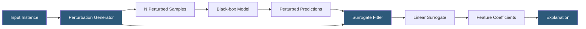

**Category:** AI Model Monitoring & Observability
**Difficulty:** Intermediate
**Reading time:** 6 min read

---

LIME (Local Interpretable Model-Agnostic Explanations) generates interpretable explanations for individual predictions by fitting a simple surrogate model around a specific prediction point. Its model-agnostic nature makes it applicable to any black-box model, including third-party APIs and proprietary systems where internal model access is unavailable.

- **Perturbation** — the process of generating nearby instances by randomly masking or modifying features of the original input
- **Surrogate model** — the simple interpretable model (linear regression, decision tree) trained on perturbed instances to approximate local model behavior
- **Locality** — LIME explanations are valid only in a local neighborhood around the explained instance, not globally
- **Exponential kernel** — weighting function giving higher weight to perturbed samples closer to the original instance in the surrogate fitting
- **Text perturbation** — masking individual words or tokens in text inputs to generate perturbed NLP samples
- **Image segmentation** — dividing images into superpixels for perturbation, enabling LIME explanations for image classifiers
- **Fidelity** — how well the surrogate model approximates the black-box model in the local neighborhood; a key quality metric for LIME explanations

LIME generates explanations by treating the model as a black box and probing its local decision surface through systematic perturbation. For tabular data, LIME perturbs feature values by randomly sampling from the training distribution for each feature and replacing the original values. For text, it generates perturbed samples by randomly removing words from the original text. For images, it creates perturbed samples by randomly blacking out superpixel segments.

Each perturbed sample is passed through the black-box model to obtain a prediction. The perturbed dataset (N samples, typically 1000-5000) is then used to fit a sparse linear regression model, with sample weights assigned using an exponential kernel that gives higher weight to perturbed samples more similar to the original instance. Similarity is typically measured in the interpretable feature space (binary presence/absence for text, segment presence for images).

The fitted linear model's coefficients represent the feature importances—the magnitude and sign indicate each feature's contribution to the prediction in the local neighborhood. Features with positive coefficients pushed the prediction toward the explained class; negative coefficients pushed away from it.

LIME's main limitation is instability: because the surrogate fitting depends on random perturbation, repeated LIME explanations for the same instance can produce different feature importance rankings. This instability increases for complex models with highly nonlinear local decision surfaces. Techniques like running multiple explanations and averaging (stabilized LIME) reduce but don't eliminate this variability.

The Python `lime` library provides `LimeTabularExplainer`, `LimeTextExplainer`, and `LimeImageExplainer` classes with a consistent API. Integration into monitoring pipelines typically uses the text or tabular explainer in an asynchronous batch mode, generating explanations for flagged or sampled prediction events rather than every inference request.

- Explaining predictions from a black-box third-party API model where internal access is unavailable
- Text classifier explanations identifying which words drove a sentiment classification decision
- Image classifier explanations highlighting which image regions influenced a classification
- Generating per-prediction explanations for samples flagged by monitoring alerts
- Compliance documentation for adverse decisions when only API access to the model is available

| Advantage | Disadvantage |
|-----------|--------------|
| Model-agnostic: works with any black-box model accessible through a prediction API | Explanations are stochastic; identical inputs can produce different explanations across runs |
| Applicable to tabular, text, and image modalities with a unified API | Fidelity of the surrogate depends on how well a linear model approximates local model behavior |
| No access to model internals required; works even with proprietary hosted models | Perturbation-based approach is computationally expensive: N model calls per explanation |
| Intuitive explanation format (feature weights) accessible to non-technical audiences | Locality assumption means explanations are invalid for inputs far from the explained instance |

- [SHAP Value Calculation](shap-value-calculation.md)
- [Feature Importance Tracking](feature-importance-tracking.md)
- [Model Explainability Tools](model-explainability-tools.md)

---
*Part of the [AI Model Monitoring & Observability](index.md) category · [Back to Master Index](../../index.md)*
