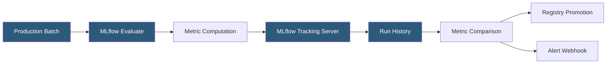

**Category:** AI Model Monitoring & Observability
**Difficulty:** Intermediate
**Reading time:** 6 min read

---

MLflow provides model monitoring capabilities through its open-source tracking server, model registry, and evaluation APIs. While not a dedicated monitoring platform, MLflow's experiment tracking infrastructure can be extended to production monitoring scenarios, and its deep integration with the ML ecosystem makes it a natural foundation for custom monitoring pipelines.

- **MLflow Evaluate** — API for computing standardized quality metrics on model predictions against a dataset and logging results to MLflow runs
- **MLflow Model Registry** — versioned model catalog with lifecycle stages (None, Staging, Production, Archived) for deployment management
- **Registered Model** — named model entity in the registry with multiple version entries, each linking to a logged model artifact
- **Metric history** — time-series of logged metric values enabling trend analysis across runs or monitoring windows
- **Model signature** — schema definition of model input/output types enabling automated input validation at serving time
- **Model validation** — pre-registration quality checks comparing a candidate model against a baseline on defined metrics
- **Databricks MLflow** — enterprise-managed MLflow service with enhanced monitoring capabilities including Unity Catalog integration

MLflow production monitoring typically follows a batch pattern: a scheduled job (Airflow DAG, Databricks Job, or cron task) collects a window of production predictions with available ground truth labels, runs `mlflow.evaluate()` against them, and logs the resulting metrics to an MLflow run under a designated monitoring experiment.

The `mlflow.evaluate()` function computes a comprehensive set of metrics based on model type: for classifiers, it computes accuracy, F1, precision, recall, ROC-AUC, and confusion matrix; for regression models, MAE, RMSE, R2, and residual plots. These are logged as MLflow metrics and artifacts, creating a persistent record in the tracking server queryable via the MLflow API or UI.

Model Registry lifecycle management enables structured promotion workflows. A model candidate must be explicitly transitioned to "Production" stage by an authorized user, providing a human approval gate. Webhooks can be triggered on stage transitions, enabling automated deployment pipeline activation when a model is promoted.

MLflow Evaluate supports custom metrics defined as Python functions, enabling domain-specific quality measures alongside standard ML metrics. It also includes LLM-specific evaluators: the `mlflow.evaluate()` function can score text generation quality using built-in judges (faithfulness, answer relevance, context recall for RAG applications) through integration with LLM judge models.

The Databricks managed version adds real-time monitoring features through Lakehouse Monitoring: automated analysis of prediction tables in Delta Lake, computing drift metrics on a scheduled cadence and writing results to monitoring metric tables for dashboard visualization.

- Batch weekly model performance evaluation using `mlflow.evaluate()` integrated with an Airflow DAG
- Model Registry promotion gates requiring accuracy above baseline before production deployment
- Drift monitoring on Databricks using Lakehouse Monitoring with Delta table prediction logs
- LLM evaluation pipelines measuring RAG faithfulness and relevance scores using MLflow's built-in judges
- Custom metric development for domain-specific quality requirements beyond standard ML metrics

| Advantage | Disadvantage |
|-----------|--------------|
| Open-source core with no licensing cost for basic tracking and evaluation | Requires significant custom development to build real-time streaming monitoring |
| Deep ecosystem integration with Databricks, SageMaker, and Azure ML | Purpose-built monitoring platforms provide more sophisticated drift detection out-of-the-box |
| Unified tooling across experiment tracking, model registry, and evaluation | UI is optimized for experiment comparison rather than production monitoring dashboards |
| LLM evaluation support in `mlflow.evaluate()` covers GenAI monitoring needs | Self-hosted deployment requires infrastructure management for high-availability operation |

- [Weights & Biases Model Monitoring](weights-biases-model-monitoring.md)
- [SageMaker Model Monitor](sagemaker-model-monitor.md)
- [Azure ML Model Monitoring](azure-ml-model-monitoring.md)

---
*Part of the [AI Model Monitoring & Observability](index.md) category · [Back to Master Index](../../index.md)*
