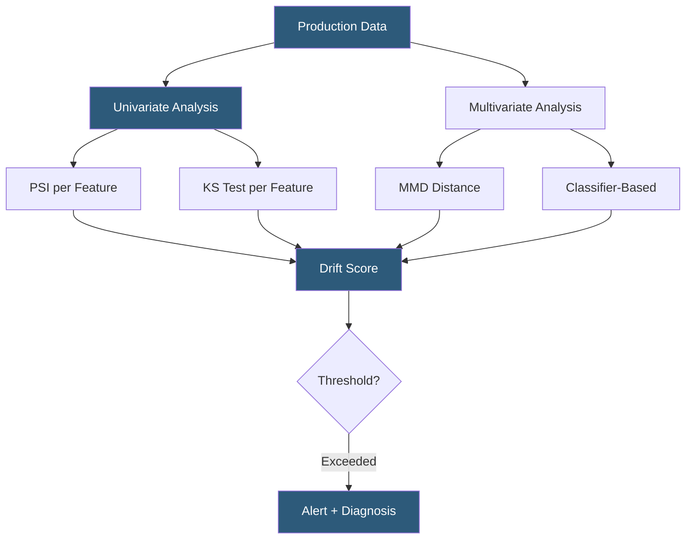

**Category:** AI Model Monitoring & Observability
**Difficulty:** Intermediate
**Reading time:** 7 min read

---

Model drift detection identifies when a deployed ML model's behavior diverges from its expected performance due to changes in input data distributions or the underlying real-world relationship between inputs and outcomes. Proactive drift detection prevents silent model degradation from creating compounding errors in production systems.

- **Covariate shift** — change in P(X), the marginal distribution of input features, while P(Y|X) remains constant; often caused by population changes
- **Concept drift** — change in P(Y|X), the relationship between features and target variable; requires model retraining to address
- **Prior probability shift** — change in P(Y), the target variable base rate, without changes in feature distributions
- **Sudden drift** — abrupt distribution change occurring within a single monitoring window
- **Gradual drift** — slow, continuous distribution change accumulating over many monitoring windows
- **Recurring drift** — cyclical drift pattern returning to previous distributions (seasonal effects)
- **Univariate drift** — drift in a single feature column analyzed independently
- **Multivariate drift** — drift in joint feature distribution not detectable through individual feature analysis

Drift detection operates on two levels: univariate analysis of individual features and multivariate analysis of joint distributions. Univariate methods are computationally efficient and interpretable—Population Stability Index (PSI) and Kolmogorov-Smirnov (KS) test are the most common. PSI bins feature distributions into equal-frequency buckets and compares bucket proportions; KS test measures the maximum absolute difference between cumulative distribution functions.

Multivariate drift methods detect distributional changes invisible to per-feature analysis. Maximum Mean Discrepancy (MMD) computes a kernel-based distance between two sample distributions in a high-dimensional feature space. Classifier-based drift detection trains a binary classifier to distinguish training samples from production samples—high classifier accuracy indicates high drift, as the samples are easily separable.

Concept drift is harder to detect in real-time because it requires ground truth labels. Proxy indicators include sudden prediction distribution shifts (suggesting the model encounters new input patterns), accuracy degradation on labeled subsets, and calibration drift (model confidence scores no longer align with empirical accuracy).

Statistical process control methods provide online drift detection: ADWIN (Adaptive Windowing) adjusts the analysis window size based on detected change points, providing adaptive sensitivity. Page-Hinkley test detects mean shifts in sequential data streams. These are particularly valuable for real-time streaming inference monitoring.

Production drift investigations begin with drift localization: identifying which features drifted most significantly. The PSI decomposition allows attribution of aggregate drift to individual feature contributions. Investigation then traces high-drift features back through the data pipeline to identify root cause—often an upstream system change, new customer segment, or external event.

- Early warning for an e-commerce recommendation model when holiday season changes customer behavior patterns
- Detecting upstream data pipeline failures through sudden univariate drift in pipeline-computed features
- Identifying when a natural language processing model encounters a new topic domain emerging in production
- Triggering automated retraining when drift accumulates above a configured threshold over multiple monitoring windows
- Investigating model accuracy degradation by isolating which feature distributional changes correlate with performance drop

| Advantage | Disadvantage |
|-----------|--------------|
| Univariate PSI detection is computationally efficient and widely interpretable | Univariate methods miss correlated feature drift not visible in individual feature margins |
| Proactive detection identifies issues before they become accuracy degradation | Statistical thresholds have false positive rates requiring calibration per feature and dataset |
| Online methods (ADWIN) enable streaming detection without batch latency | Concept drift detection requires ground truth labels unavailable in real-time for most applications |
| Multivariate methods catch complex distributional changes | MMD computation scales quadratically with sample size, requiring approximations at scale |

- [Data Drift Analysis](data-drift-analysis.md)
- [Concept Drift Monitoring](concept-drift-monitoring.md)
- [Arize Drift Detection](arize-drift-detection.md)

---
*Part of the [AI Model Monitoring & Observability](index.md) category · [Back to Master Index](../../index.md)*
