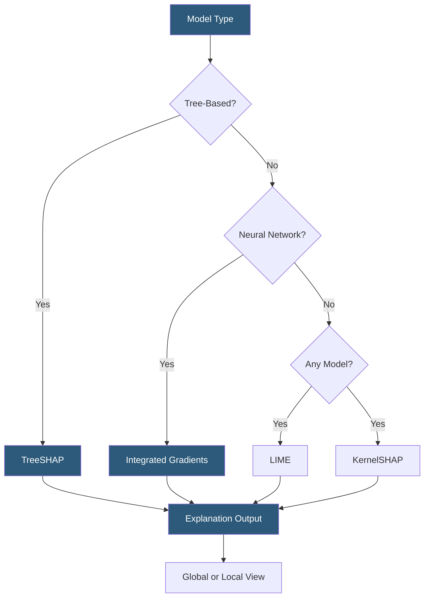

**Category:** AI Model Monitoring & Observability
**Difficulty:** Advanced
**Reading time:** 7 min read

---

Model explainability tools generate interpretable explanations for ML model predictions, helping practitioners understand which features drive individual predictions and aggregate model behavior. These tools are essential for debugging, regulatory compliance, and building stakeholder trust in deployed AI systems.

- **SHAP (Shapley Additive Explanations)** — game-theoretic feature attribution method providing consistent, locally accurate explanations with solid mathematical foundations
- **LIME (Local Interpretable Model-Agnostic Explanations)** — model-agnostic method that fits an interpretable surrogate model locally around a prediction to generate explanations
- **Integrated Gradients** — gradient-based attribution for neural networks computing feature importance by integrating gradients along the path from a baseline to the input
- **Attention visualization** — for transformer models, visualization of attention weights as a proxy for feature importance (though interpretability of attention as explanation is debated)
- **Global explanation** — aggregate feature importance across many predictions, showing what the model relies on overall
- **Local explanation** — per-prediction feature attribution showing why the model produced a specific output for a specific input
- **Counterfactual** — the minimal input change that would flip the model's prediction, providing actionable recourse for adverse decisions

SHAP is the dominant explainability method due to its theoretical properties: local accuracy (explanations sum to the difference between prediction and baseline), missingness (features with zero value receive zero attribution), and consistency (features with higher impact always receive higher or equal attribution). The TreeSHAP variant computes exact SHAP values for tree-based models in polynomial time, making it practical for production use.

LIME operates by perturbing the input (sampling nearby points with features masked), observing model outputs on these perturbed samples, and fitting a simple linear model to the perturbed outputs. The linear model coefficients serve as feature importances for the specific prediction being explained. LIME is model-agnostic but produces approximate explanations that may be unstable across nearby inputs.

Integrated Gradients addresses neural networks by selecting a baseline input (typically zeros or mean values) and computing the integral of gradients as the input linearly interpolates from baseline to actual input. This attribution satisfies the sensitivity axiom (if changing a feature changes the output, it receives non-zero attribution) and implementation invariance (attributions are identical for functionally equivalent networks).

For LLMs, token-level attribution methods (SHAP with text perturbation, or attention visualization) identify which input tokens most influenced the generated output. These explanations are valuable for debugging hallucinations and understanding which parts of a retrieved context the model used.

Production integration of explainability tools must balance explanation quality against computational cost. TreeSHAP is fast enough for real-time use; KernelSHAP and LIME require sampling and are better suited for asynchronous background computation or on-demand analysis rather than inline per-request execution.

- Generating adverse action notices for credit decisions explaining which factors most influenced the denial
- Debugging a model that performs well overall but fails on specific demographic cohorts by examining SHAP value differences
- Model validation documentation demonstrating that the model relies on the expected features for regulatory review
- Developer debugging: tracing why a document classifier incorrectly predicted a specific document's category
- Monitoring for feature importance drift to detect emerging concept drift before accuracy degrades

| Advantage | Disadvantage |
|-----------|--------------|
| SHAP's theoretical properties ensure consistent, mathematically principled attributions | TreeSHAP requires white-box access; KernelSHAP scales poorly to high-dimensional feature spaces |
| LIME's model-agnosticism works with any black-box model including third-party APIs | LIME explanations may be unstable—similar inputs can produce different explanations |
| Counterfactual explanations provide actionable recourse for regulated decision-making | Integrated Gradients results depend on baseline selection, which is not always obvious |
| Attention visualization is computationally cheap for transformer models | Attention weights are not reliable explanations of transformer model behavior |

- [SHAP Value Calculation](shap-value-calculation.md)
- [LIME Explanations](lime-explanations.md)
- [Fiddler Explainability Platform](fiddler-explainability-platform.md)

---
*Part of the [AI Model Monitoring & Observability](index.md) category · [Back to Master Index](../../index.md)*
