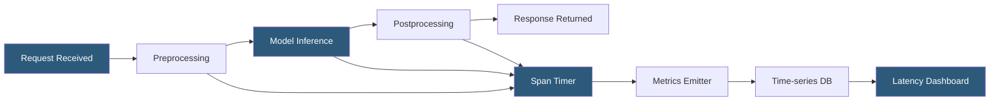

**Category:** AI Model Monitoring & Observability
**Difficulty:** Intermediate
**Reading time:** 5 min read

---

Model latency tracking measures and monitors the time components of ML inference pipelines to ensure SLA compliance, identify performance bottlenecks, and detect infrastructure or model changes that degrade response times. It is a critical operational metric alongside quality metrics for production ML systems.

- **Time-to-first-token (TTFT)** — for streaming LLM applications, the latency from request receipt to first output token generation
- **End-to-end latency** — total elapsed time from receiving a prediction request to returning the response to the caller
- **Inference latency** — time spent on the model computation portion of the request, excluding preprocessing, postprocessing, and network overhead
- **p95/p99 latency** — 95th and 99th percentile latency values; better SLA metrics than mean because they capture tail behavior affecting worst-case user experience
- **Cold start latency** — elevated latency for the first request after a period of inactivity, relevant for serverless or auto-scaled serving
- **Batching overhead** — additional waiting time when requests are held to form a batch before processing
- **GPU utilization correlation** — relationship between GPU utilization levels and inference latency used to identify compute saturation

Model latency tracking instruments the serving pipeline with span-level timers capturing duration for each processing stage: feature retrieval, preprocessing transformations, model inference computation, and postprocessing. These span measurements are emitted as histogram metrics to the monitoring system at request completion.

Histogram metrics (rather than averages) capture the full latency distribution. Prometheus histograms define configurable bucket boundaries (e.g., 10ms, 50ms, 100ms, 500ms, 1000ms) and count requests falling into each bucket. This enables computing any percentile from a single metric series, which is essential for SLA compliance checking.

For LLM applications, TTFT and token generation throughput (tokens/second) are the primary latency metrics. TTFT is particularly important for streaming interfaces where users receive incremental output—high TTFT creates a subjectively poor experience even when total generation time is acceptable. Token generation rate tracks whether GPU compute capacity is saturating.

Latency anomaly detection uses control chart methods: computing the rolling mean and standard deviation of latency percentiles and alerting when values exceed N standard deviations from the rolling mean. This automatically adapts to expected diurnal latency patterns (higher during peak traffic hours) without requiring separate thresholds for different time-of-day windows.

Distributed tracing (OpenTelemetry, Jaeger) provides request-level trace data for latency investigation. When a latency alert fires, engineers inspect individual trace records from the high-latency window to identify which pipeline component is the bottleneck—model inference time, database lookup latency, or network round-trip overhead.

- SLA compliance monitoring for a real-time recommendation API with a p99 latency SLA of 200ms
- Detecting GPU memory pressure causing inference latency spikes during high-traffic periods
- Identifying preprocessing bottlenecks through span-level latency breakdown
- Monitoring TTFT degradation in a streaming LLM interface after a model update
- Capacity planning using latency percentile trends to predict when additional GPU capacity will be needed

| Advantage | Disadvantage |
|-----------|--------------|
| Percentile metrics capture tail latency behavior affecting worst-case user experience | Histogram bucket misconfiguration can miss important latency ranges |
| Span-level instrumentation pinpoints bottleneck components without full trace overhead | Distributed tracing at high request volumes generates large trace storage requirements |
| Anomaly detection adapts to expected traffic patterns automatically | Batching strategies that improve throughput inherently increase individual request latency |
| TTFT tracking addresses user experience in streaming LLM applications | Cold start latency spikes from auto-scaling are difficult to mitigate and may require prewarming |

- [Real-time Monitoring Dashboards](real-time-monitoring-dashboards.md)
- [Inference Cost Monitoring](inference-cost-monitoring.md)
- [GPU Utilization Monitoring](gpu-utilization-monitoring.md) 

---
*Part of the [AI Model Monitoring & Observability](index.md) category · [Back to Master Index](../../index.md)*
