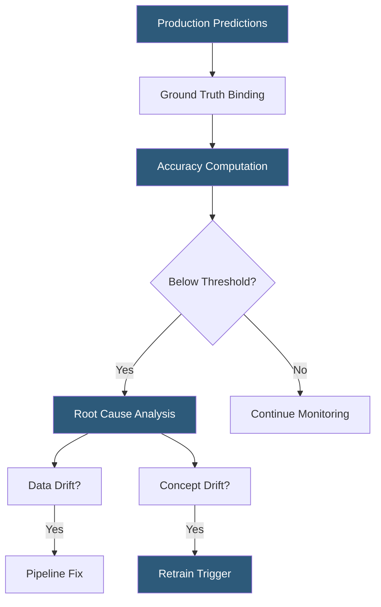

**Category:** AI Model Monitoring & Observability
**Difficulty:** Intermediate
**Reading time:** 6 min read

---

Model performance degradation describes the progressive decline in an ML model's predictive accuracy over time after deployment. Understanding its causes, detection mechanisms, and remediation strategies is fundamental to maintaining production ML systems that deliver reliable business value.

- **Accuracy decay** — gradual reduction in predictive accuracy as the production environment diverges from training conditions
- **Stale model** — a model whose training data no longer represents current real-world patterns, resulting in systematically degraded performance
- **Ground truth gap** — the time delay between making a prediction and observing the actual outcome, constraining real-time accuracy monitoring
- **Performance baseline** — the model's accuracy metrics at deployment time, used as the reference for measuring degradation magnitude
- **Degradation rate** — speed at which model accuracy declines, ranging from sudden (catastrophic input change) to gradual (slow concept drift)
- **Silent failure** — performance degradation occurring without obvious error signals, remaining undetected until business impact becomes measurable
- **Retraining trigger** — automated or manual decision point initiating model retraining based on observed performance degradation

Performance degradation monitoring requires comparing current model predictions against observable ground truth outcomes. For most production applications, this comparison is retrospective: predictions are logged at serving time, outcomes are observed later, and the monitoring system performs a delayed join to compute accuracy on the matched prediction-outcome pairs.

Accuracy computation varies by model type: classification models track F1, precision, recall, and AUROC; regression models track MAE, RMSE, and MAPE. The computed metrics are compared against the baseline established at deployment, with alert thresholds defining acceptable degradation bounds.

Root cause investigation follows an accuracy degradation alert. The investigation distinguishes between data drift (upstream data quality issues affecting features without changing the real-world relationship), concept drift (the real-world relationship itself has changed), and model bugs (code changes breaking feature computation or prediction logic).

Data drift-caused degradation is often remediable without retraining: fixing the upstream data pipeline restores feature quality, and model accuracy recovers. Concept drift-caused degradation requires retraining on more recent data. The two are distinguished by examining whether feature distributions have shifted (PSI analysis) and whether model accuracy degrades uniformly or only on specific feature segments.

Degradation severity classification guides remediation urgency. Minor degradation (2-5% accuracy drop) warrants monitoring cadence increase and investigation. Moderate degradation (5-15% drop) triggers a formal investigation with retraining plan. Severe degradation (>15% drop) warrants immediate escalation, potential model rollback to a previous version, and emergency retraining.

- Detecting credit scoring model degradation after a macroeconomic shift changes borrower risk profiles
- Rollback decision-making: reverting a newly deployed model version when post-deployment accuracy monitoring shows regression
- Scheduled performance review detecting gradual accuracy decay in a demand forecasting model
- Business impact quantification: translating 3% accuracy degradation to estimated revenue impact for prioritization
- SLA monitoring for ML models with contractual accuracy guarantees requiring alerting before breach

| Advantage | Disadvantage |
|-----------|--------------|
| Ground-truth-based accuracy metrics are directly interpretable and business-relevant | Delayed ground truth means degradation may persist for hours or days before detection |
| Severity-based triage enables proportionate response without over-reacting to noise | Retraining cadence decisions balance model freshness against training compute cost |
| Historical accuracy time-series enables trend analysis and degradation rate estimation | Silent failures in delayed-label scenarios can compound before detection |
| Root cause distinction between data drift and concept drift avoids unnecessary retraining | Investigation requires correlating multiple signals (accuracy, data drift, prediction drift) |

- [Model Drift Detection](model-drift-detection.md)
- [Real-time Monitoring Dashboards](real-time-monitoring-dashboards.md)
- [A/B Testing for Models](ab-testing-for-models.md)

---
*Part of the [AI Model Monitoring & Observability](index.md) category · [Back to Master Index](../../index.md)*
