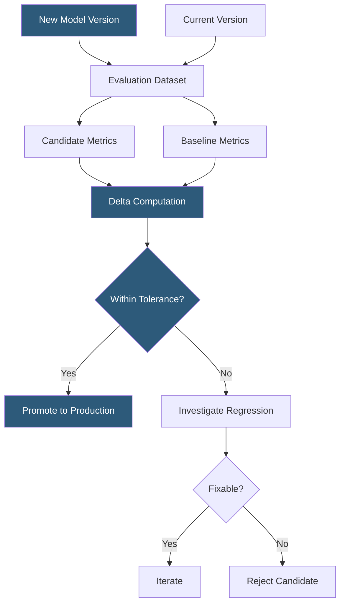

**Category:** AI Model Monitoring & Observability
**Difficulty:** Intermediate
**Reading time:** 5 min read

---

Model version comparison systematically evaluates differences in prediction behavior, performance metrics, and resource consumption between model versions to validate upgrades, investigate regressions, and inform deployment decisions. It provides the quantitative evidence base for confident model promotion or rollback decisions.

- **Side-by-side evaluation** — running the same request set through two model versions and comparing outputs directly
- **Metric delta** — absolute or relative difference in a performance metric between the candidate and baseline model version
- **Behavioral equivalence testing** — checking that a new model version produces statistically indistinguishable outputs from the previous version on a reference dataset
- **Prediction comparison** — analysis of where two model versions disagree, identifying the characteristics of requests where the candidate model behaves differently
- **Shadow deployment** — serving traffic to the new model version without returning its responses to users, collecting predictions for offline comparison
- **Canary comparison** — comparing metrics between a small percentage of live traffic served by a new version versus the remaining traffic served by the current version
- **Rollback threshold** — predefined metric degradation level that automatically triggers reversion to the previous model version

Pre-deployment model version comparison operates on a held-out evaluation dataset (ideally a recent slice of production data with ground truth labels). Both the candidate and baseline models generate predictions on the identical input set. Performance metrics are computed for each and compared against predefined tolerance thresholds.

Statistical significance testing is critical for small evaluation datasets. A 0.5% accuracy improvement on a 1,000-sample test set may not be statistically significant. McNemar's test compares paired classification outputs; Wilcoxon signed-rank test compares paired regression outputs. Both produce p-values indicating whether the observed difference exceeds what would be expected by chance.

Disagreement analysis provides qualitative insight beyond aggregate metrics. Requests where the candidate model disagrees with the baseline are segmented by feature values to identify systematic behavioral differences: the candidate might improve on certain document types while regressing on others.

Shadow deployment enables live traffic comparison without user exposure. The new model version receives copies of all production requests, generates predictions stored to a database, and these are compared against the current version's live predictions. This captures real distribution data—which may differ from held-out evaluation datasets—while protecting users from potential regressions.

Canary comparison extends shadow testing to include partial user exposure: 5-10% of live traffic is served by the candidate version, with metrics compared between the canary cohort and the control cohort. Statistical process control methods determine whether metric differences between cohorts are significant.

- Pre-deployment validation requiring a new model version to match or exceed baseline on all tracked metrics
- Regression investigation after a training data update identifying which request types degraded
- Rolling deployment decision-making using real-time metric comparison between canary and control traffic
- Model rollback decision using automated threshold-based comparison when post-deployment monitoring shows degradation
- Regulatory model change documentation providing audit trail of quantitative comparison evidence for model updates

| Advantage | Disadvantage |
|-----------|--------------|
| Quantitative evidence base reduces subjectivity in promotion and rollback decisions | Small evaluation datasets may produce statistically unreliable metric comparisons |
| Disagreement analysis pinpoints the request types affected by model changes | Shadow deployment doubles inference cost during the evaluation period |
| Automated rollback thresholds reduce mean time to recovery for deployment regressions | Held-out evaluation datasets may not represent current production distribution |
| Canary comparison captures real traffic patterns unavailable in offline evaluation | Statistical significance testing requires sufficient sample size, which may take time to accumulate |

- [A/B Testing for Models](ab-testing-for-models.md)
- [Shadow Model Deployment](shadow-model-deployment.md)
- [Champion-Challenger Testing](champion-challenger-testing.md)

---
*Part of the [AI Model Monitoring & Observability](index.md) category · [Back to Master Index](../../index.md)*
