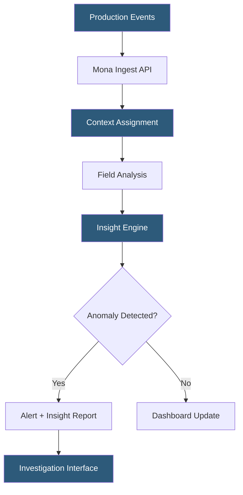

**Category:** AI Model Monitoring & Observability
**Difficulty:** Intermediate
**Reading time:** 6 min read

---

Mona Labs provides AI monitoring focused on contextual performance analysis and deep investigation capabilities. It emphasizes understanding model behavior in the context of specific business scenarios and user populations rather than treating all prediction events uniformly, enabling more actionable monitoring insights for complex production environments.

- **Context** — Mona's central modeling concept grouping prediction events by business scenario, user type, or workflow stage for targeted analysis
- **Insight** — automatically detected pattern or anomaly in monitoring data surfaced by Mona's analysis engine
- **Field** — individual data attribute logged with each prediction event (features, outputs, metadata)
- **Segment** — population filter defining a sub-set of predictions for focused monitoring
- **Baseline** — configurable reference period or dataset used as the comparison anchor for drift and performance analysis
- **Anomaly score** — statistical measure of how unusual the current period's metrics are relative to historical patterns
- **Investigation query** — interactive analytical query against stored prediction data for root cause analysis

Mona's contextual monitoring approach begins with Context schema definition: users declare which fields constitute a monitoring context (e.g., prediction events grouped by product category, user cohort, or geographic region). This enables monitoring metrics to be automatically computed and tracked per context rather than only in aggregate—catching localized degradation that aggregate metrics mask.

The Insight Engine continuously scans monitored metrics for statistically significant patterns, applying multiple detection methods: time-series anomaly detection identifying sudden changes, trend analysis identifying gradual drift, correlation analysis identifying co-moving metrics, and cluster analysis identifying unusual prediction sub-populations. Detected patterns are ranked by statistical significance and business impact (when business outcome data is available) and surfaced as Insights on the monitoring dashboard.

Mona's data architecture supports high-cardinality context dimensions efficiently—monitoring metrics across thousands of distinct context values (e.g., one context per customer segment) without requiring manual configuration of individual monitors per context. This scales naturally as new contexts emerge in production without requiring monitoring reconfiguration.

The investigation interface enables interactive queries against stored prediction data using a point-and-click segmentation tool. Users drill from an insight (elevated refusal rate in product category X) through to the underlying prediction records (showing which specific inputs caused the pattern) without writing SQL or custom analytical code.

Mona integrates with serving infrastructure through a REST API accepting prediction events as JSON objects with schema defined at Context registration time. Integration libraries exist for Python, Node.js, and Java, with webhook-based event streaming supported for real-time serving architectures.

- Monitoring a content recommendation model by context (content type, user demographic, platform) to identify segment-specific degradation
- Automatically detecting emerging patterns in LLM outputs without pre-defined alert conditions
- Investigating why a fraud model's performance degraded in a specific geographic region
- Tracking model behavior evolution over seasonal periods using configurable baseline windows
- Identifying which user cohorts are disproportionately affected by a model update

| Advantage | Disadvantage |
|-----------|--------------|
| Context-based monitoring catches segment-specific degradation invisible in aggregate | Context schema design requires upfront domain expertise and iteration |
| Automated insight generation reduces need for manual monitoring rule configuration | Insight volume can be high in complex environments; prioritization requires tuning |
| High-cardinality context support scales to complex multi-segment applications | Custom segment analysis requires understanding Mona's query model |
| Investigation interface reduces SQL expertise barrier for non-technical root cause analysis | Storing full prediction records raises data governance and storage cost considerations |

- [Superwise Model Monitoring](superwise-model-monitoring.md)
- [Galileo Observability](galileo-observability.md)
- [Model Performance Degradation](model-performance-degradation.md)

---
*Part of the [AI Model Monitoring & Observability](index.md) category · [Back to Master Index](../../index.md)*
