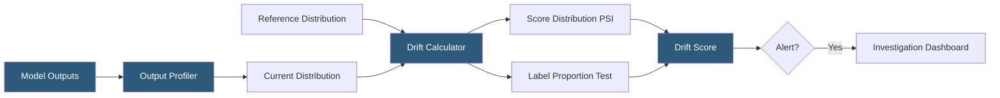

**Category:** AI Model Monitoring & Observability
**Difficulty:** Intermediate
**Reading time:** 5 min read

---

Prediction drift tracking monitors changes in the distribution of model output scores or class probabilities over time. Unlike accuracy monitoring, prediction drift can be detected without ground truth labels, providing a leading indicator of potential model degradation before outcome labels become available.

- **Output distribution** — the statistical distribution of model predictions (probability scores, class labels, or regression values) across a population of requests
- **Score distribution drift** — shift in the distribution of continuous probability scores from a classification model
- **Label distribution drift** — change in the proportion of predicted classes for a classification model
- **Regression output drift** — shift in the distribution of predicted values for regression models
- **Leading indicator** — a metric that changes before ground-truth-based accuracy metrics, providing earlier warning of model issues
- **Output calibration drift** — change in the relationship between predicted probabilities and empirical outcome frequencies
- **Confidence distribution** — distribution of model confidence scores across predictions, useful for detecting changes in model certainty

Prediction drift monitoring applies the same statistical distance methods used for input feature drift to model outputs. For binary classification models, the output is typically a probability score between 0 and 1. The reference distribution of these scores (from training validation or an initial production baseline) is binned into a histogram. Current production score distributions are compared using PSI or Jensen-Shannon divergence.

Label distribution drift for classification models monitors the proportion of predictions falling into each class. Significant changes in the predicted positive rate may indicate input distribution shift or concept drift. For a fraud detection model, a sudden increase in the predicted fraud rate could indicate genuine fraud wave or could indicate input data quality issues causing the model to misfire.

Prediction drift is particularly valuable as a label-free proxy for accuracy drift. When ground truth labels require significant time to accumulate (outcome-delayed applications: insurance claims, medical diagnoses, long-term customer churn), prediction drift provides an early warning signal in the interim.

Output confidence distribution analysis examines how certain the model is across its predictions. A shift toward lower confidence scores across the board may indicate the model is encountering input patterns increasingly unlike its training distribution, even if the predicted class labels haven't shifted significantly.

Regression model output monitoring tracks distributional statistics (mean, variance, percentiles) and drift metrics. For models predicting continuous outcomes (prices, risks, durations), shifts in the mean or variance of predictions relative to the baseline distribution signal potential issues worth investigation.

- Early warning for a credit scoring model where loan outcomes take months to realize
- Detecting when a recommendation model's predicted engagement scores shift significantly after a content catalog change
- Monitoring a medical risk classifier for changes in the predicted risk score distribution across patient populations
- Identifying when a sentiment classifier begins predicting more neutral scores across previously clearly positive/negative inputs
- Label-free monitoring for real-time applications where low-latency detection is required before ground truth accumulates

| Advantage | Disadvantage |
|-----------|--------------|
| Label-free detection enables monitoring without waiting for outcome realization | Prediction drift may not correlate with actual accuracy changes; false alarms are possible |
| Earlier detection compared to outcome-based accuracy monitoring | Direction of causality is unclear: prediction drift may be appropriate response to genuine input changes |
| Same statistical tools as input drift analysis simplify tooling and operations | Calibration drift requires probability scoring, not applicable to models returning hard class labels only |
| Captures the integrated effect of input drift on model behavior without feature attribution | Threshold calibration requires empirical validation against historical accuracy drift events |

- [Data Drift Analysis](data-drift-analysis.md)
- [Concept Drift Monitoring](concept-drift-monitoring.md)
- [Model Performance Degradation](model-performance-degradation.md)

---
*Part of the [AI Model Monitoring & Observability](index.md) category · [Back to Master Index](../../index.md)*
