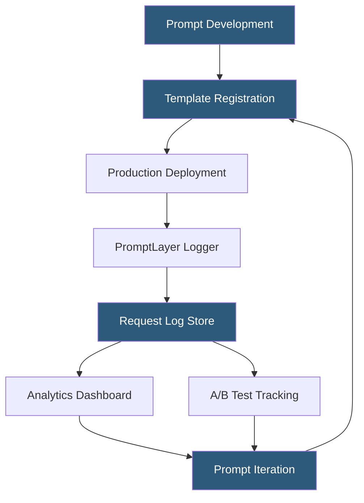

**Category:** AI Model Monitoring & Observability
**Difficulty:** Beginner
**Reading time:** 5 min read

---

PromptLayer is an LLM request tracking and prompt management platform that logs all LLM API calls with associated metadata, enabling prompt version management, A/B testing, and request history analysis. It focuses on the prompt engineering workflow, providing tools that bridge the gap between development and production prompt management.

- **Request log** — stored record of every LLM API call including prompt, response, model, token counts, latency, and cost
- **Prompt template** — named, versioned prompt with variable placeholders managed in PromptLayer's registry
- **Template version** — immutable snapshot of a prompt template enabling rollback and comparison
- **Tag** — categorical label applied to requests for filtering and analysis (e.g., environment, feature, use case)
- **Group** — logical collection of related requests (e.g., all requests in a multi-turn conversation)
- **Request search** — full-text search across stored request history for specific prompt patterns or response content
- **Metadata** — custom key-value pairs attached to requests for business context enrichment



PromptLayer wraps the OpenAI and Anthropic Python clients, intercepting API calls to log them before returning responses to the caller. The integration involves replacing the standard client import with the PromptLayer-wrapped version:

```python
import promptlayer
openai = promptlayer.openai
```

All subsequent OpenAI API calls are automatically logged to PromptLayer with the original parameters and response. The wrapper adds negligible latency (typically under 5ms) as logging is asynchronous.

Prompt template management allows teams to define templates in the PromptLayer UI, assign version numbers, and fetch them at runtime via `promptlayer.templates.get("template-name", version=3)`. This decouples prompt content from application deployments—a prompt engineer can update a template version in PromptLayer and the application fetches the new version on the next request without requiring code changes or redeployment.

Request tagging enables segmentation: adding `pl_tags=["production", "user-onboarding"]` to API calls tags those requests for filtered analysis. Teams track performance metrics, costs, and response patterns per tag, enabling comparison between use cases or environments.

A/B testing is supported through template version tagging: production traffic is split between template version 3 and version 4 by specifying different versions in the fetch call. Request logs include version information, enabling statistical comparison of response quality, token counts, and user feedback across template versions.

The search interface allows querying the full request history by prompt content, response content, tag, model, date range, or metadata values—enabling practitioners to find specific historical requests for debugging, compliance review, or pattern analysis.

- Prompt version management enabling non-engineers to update production prompts without code deployments
- A/B testing two prompt variants to determine which produces better user satisfaction ratings
- Debugging a production issue by searching request logs for prompts that triggered problematic responses
- Cost tracking across different prompt templates to identify high-cost patterns for optimization
- Compliance audit trail providing full history of all LLM requests and responses

| Advantage | Disadvantage |
|-----------|--------------|
| Simple wrapper integration works with minimal code changes | Primarily supports OpenAI and Anthropic; other providers require more custom integration |
| Template management enables prompt iteration without code deployments | Full request/response logging raises privacy concerns for applications handling sensitive data |
| Request search enables efficient debugging and pattern investigation | Less comprehensive monitoring than full ML observability platforms for traditional ML models |
| A/B testing at the prompt level enables data-driven prompt optimization | Platform lock-in for prompt templates; migrating requires exporting templates and updating fetchers |

- [Helicone LLM Monitoring](helicone-llm-monitoring.md)
- [LangFuse LLM Observability](langfuse-llm-observability.md)
- [LangSmith LLM Monitoring](langsmith-llm-monitoring.md)

---
*Part of the [AI Model Monitoring & Observability](index.md) category · [Back to Master Index](../../index.md)*
