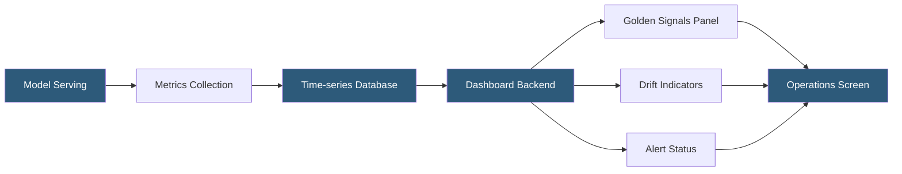

**Category:** AI Model Monitoring & Observability
**Difficulty:** Intermediate
**Reading time:** 5 min read

---

Real-time monitoring dashboards provide live visualization of ML model health metrics, enabling operations teams to detect and respond to production incidents as they occur. Effective dashboard design prioritizes signal over noise, surfacing actionable metrics while avoiding alert fatigue from excessive visualization complexity.

- **Golden signals** — the four key observability metrics adapted for ML: accuracy (quality), throughput (volume), latency (performance), and error rate (reliability)
- **Time-series panel** — chart showing metric values over time with configurable lookback windows and resolution
- **Heat map** — visual representation of metric distributions across time and feature/segment dimensions
- **Alert state indicator** — dashboard element showing current alert status (OK, warning, critical) for quick triage
- **Drill-down capability** — ability to navigate from summary metrics to component-level or sample-level detail
- **Refresh rate** — frequency at which dashboard panels pull new data; near-real-time (seconds) vs near-live (minutes)
- **Dashboard-as-code** — defining dashboard configurations in version-controlled YAML or JSON (Grafana, Datadog) for reproducibility

Real-time ML monitoring dashboards typically build on existing observability infrastructure—Grafana with Prometheus, Datadog, or cloud provider monitoring consoles—extending them with ML-specific metric sources alongside application and infrastructure metrics.

Metric collection for real-time dashboards requires a streaming metrics pathway distinct from the batch analysis path used for drift detection. Model serving components emit metrics to a time-series database: prediction request rates (requests per second), inference latency percentiles (p50, p95, p99), prediction score means and variances in rolling windows, and error rates. These are collected via Prometheus scraping, StatsD emission, or cloud monitoring agent sidecars.

Dashboard layout follows an inverted pyramid information architecture: summary health indicators at the top (overall model status, current SLA compliance), key performance indicators in the middle (accuracy trend line, drift index, latency distribution), and detail panels at the bottom (per-feature drift scores, per-endpoint breakdown, sample prediction viewer).

Drill-down capability is critical for incident response. Operators clicking a degradation alert should reach a pre-built investigation view showing: time-of-degradation localization, which features or segments are affected, recent prediction sample examples, and comparison against the previous stable period.

Dashboard refresh rates balance freshness against backend load. Near-real-time panels (5-30 second refresh) are appropriate for serving reliability metrics (error rate, latency). Near-live panels (1-5 minute refresh) suit statistical metrics (rolling accuracy, drift scores) where sub-minute freshness provides no additional actionability.

- Operations center display showing ML model health alongside application and infrastructure status for a production platform
- On-call engineer triage dashboard during a production incident with drill-down to prediction-level details
- Executive dashboard summarizing model portfolio health with SLA compliance across all deployed models
- Model deployment validation dashboard tracking metrics during the first 24 hours after a new version release
- Feature team dashboards embedding ML quality metrics alongside product engagement metrics

| Advantage | Disadvantage |
|-----------|--------------|
| Real-time visibility enables rapid incident detection and response | Streaming metric collection adds infrastructure complexity versus batch monitoring |
| Dashboard-as-code enables version control and reproducible environment provisioning | Designing effective dashboards requires iterative refinement with operations team feedback |
| Integration with existing observability tools reduces tool sprawl | Too many panels causes alert fatigue; effective dashboards require disciplined scope |
| Drill-down capability reduces MTTR by pre-building investigation pathways | High-refresh dashboards create backend query load that must be planned for at scale |

- [Model Latency Tracking](model-latency-tracking.md)
- [Model Performance Degradation](model-performance-degradation.md)
- [Inference Cost Monitoring](inference-cost-monitoring.md)

---
*Part of the [AI Model Monitoring & Observability](index.md) category · [Back to Master Index](../../index.md)*
