**Category:** AI Model Monitoring & Observability
**Difficulty:** Advanced
**Reading time:** 7 min read

---

Amazon SageMaker Model Monitor is a managed service that automatically monitors ML models deployed on SageMaker endpoints for data quality, model quality, bias drift, and feature attribution drift. It integrates natively with the SageMaker ecosystem, enabling comprehensive production monitoring with minimal infrastructure management.

- **Data Quality Monitor** — detects changes in statistical properties of input features compared to a training baseline
- **Model Quality Monitor** — tracks model accuracy metrics by comparing predictions against ground truth labels ingested asynchronously
- **Bias Drift Monitor** — monitors changes in bias metrics for protected attributes using Amazon SageMaker Clarify
- **Feature Attribution Drift Monitor** — tracks changes in SHAP-based feature importance using SageMaker Clarify
- **Baseline** — statistical constraints generated from training data using `create_baseline_job`, serving as the monitoring reference
- **Monitoring schedule** — cron-based or endpoint-triggered schedule defining when monitoring analysis jobs run
- **Constraint violation** — individual metric that breaches its baseline threshold, reported in the monitoring output

```mermaid
graph LR
    A[SageMaker Endpoint] --> B[Data Capture]
    B --> C[S3 Capture Store]
    C --> D[Model Monitor Schedule]
    D --> E[Analysis Container]
    E --> F[Constraint Violation Report]
    F --> G[CloudWatch Metrics]
    G --> H[CloudWatch Alarms]
    H --> I[SNS Notification]
    style A fill:#2d5a7a,color:#fff
    style B fill:#2d5a7a,color:#fff
    style D fill:#2d5a7a,color:#fff
    style F fill:#2d5a7a,color:#fff
```

SageMaker Model Monitor operates through data capture: endpoints configured with `DataCaptureConfig` log a percentage of request/response pairs to S3 in a structured format. Capture rate is configurable (typically 5-100% of traffic) based on cost and storage requirements.

The baseline job processes training data through a SageMaker processing job to generate constraint files—statistical summaries including distributions and ranges for each feature and output column. These constraints are stored in S3 and serve as the reference for all subsequent monitoring comparisons.

Monitoring schedules are cron-based SageMaker jobs that periodically run analysis containers against the captured production data. The built-in containers compare production statistics against the baseline, identifying constraint violations (features with PSI above threshold, null rates above constraint, value ranges exceeded). Results are written to S3 as JSON violation reports and published as CloudWatch metrics.

Bias and feature attribution monitoring use SageMaker Clarify under the hood—the same analysis service used for pre-deployment bias analysis during model development. This consistency ensures monitoring uses the same bias metric calculations used to validate the model initially.

Ground truth ingestion for Model Quality Monitor requires a merge operation: prediction capture events are matched against ground truth labels (uploaded with matching event IDs) to compute accuracy, precision, recall, and F1. This typically has a delay matching the business process generating ground truth.

CloudWatch integration enables standard AWS alerting: monitoring metrics published to CloudWatch trigger alarms, which invoke SNS notifications or Lambda functions for custom alert processing and remediation automation.

- Automated drift detection for all models deployed on SageMaker without additional infrastructure
- Bias monitoring for HR or financial models to detect emerging fairness regressions post-deployment
- Ground-truth-based accuracy monitoring for a fraud detection model with delayed label availability
- Feature attribution drift tracking to detect when feature importance patterns change in production
- Integrating model monitoring alerts with existing AWS CloudWatch operational dashboards

| Advantage | Disadvantage |
|-----------|--------------|
| Fully managed service eliminates monitoring infrastructure operation | Tightly coupled to SageMaker endpoints; models on other platforms require separate solutions |
| Native CloudWatch integration works with existing AWS operational tooling | Ground truth merge complexity requires careful event ID management and matching pipeline |
| Clarify integration provides consistent bias metrics from development through production | Monitoring jobs run on schedules, not in real-time; detection latency equals schedule interval |
| Four monitoring types (data quality, model quality, bias, attribution) cover comprehensive needs | Configuring all four monitor types for a single endpoint requires significant setup investment |

- [Azure ML Model Monitoring](azure-ml-model-monitoring.md)
- [Vertex AI Model Monitoring](vertex-ai-model-monitoring.md)
- [MLflow Model Monitoring](mlflow-model-monitoring.md)

---
*Part of the [AI Model Monitoring & Observability](index.md) category · [Back to Master Index](../../index.md)*
