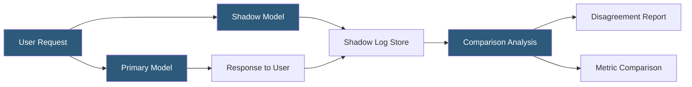

**Category:** AI Model Monitoring & Observability
**Difficulty:** Intermediate
**Reading time:** 5 min read

---

Shadow model deployment runs a new model version alongside the production model on identical live traffic without exposing its responses to end users. It enables comprehensive behavioral comparison using real production data distribution while maintaining complete user experience isolation from the experimental model.

- **Shadow traffic** — a copy of live production requests routed to the shadow model in parallel with the primary model
- **Primary model** — the current production model whose responses are returned to users
- **Shadow model** — the experimental model receiving duplicated traffic; its responses are logged but not served to users
- **Async shadow execution** — shadow model inference runs asynchronously after the primary response is returned, avoiding latency impact
- **Response comparison** — post-hoc comparison of shadow model predictions against primary model predictions or ground truth labels
- **Traffic mirroring** — network-level request duplication (at load balancer or service mesh) enabling shadow routing without application code changes
- **Shadow lag** — time delay in shadow analysis results due to asynchronous processing

Shadow deployment implementation follows one of two patterns. In the application-layer pattern, the serving code explicitly calls both models: the primary model call blocks the response path, while the shadow model call is made asynchronously (fire-and-forget), logging results without blocking user response delivery. This approach adds minimal latency (the async call overhead) but requires application code modification.

In the infrastructure-layer pattern, a service mesh (Istio, Envoy) or load balancer mirrors traffic at the network level, creating a complete duplicate request stream routed to the shadow serving endpoint. This approach enables shadow deployment without any application code changes and is preferred for organizations with mature service mesh infrastructure.

Shadow model responses are logged to a comparison store alongside the corresponding primary model predictions and request identifiers. Batch analysis jobs compute disagreement metrics: the percentage of requests where shadow and primary models produce different predictions, the magnitude of score differences for continuous outputs, and the characteristics of requests where disagreement is highest.

For binary classification models, disagreement analysis produces a confusion matrix comparing shadow predictions against primary predictions (treating primary as the "ground truth" for comparison purposes). The quadrants where shadow predicts positive but primary predicts negative (and vice versa) receive focused investigation to understand whether the shadow model is making improvements or regressions.

Shadow testing is particularly valuable for models where the cost of a failed A/B test (serving bad predictions to users) is unacceptable—such as medical diagnosis tools, safety systems, or high-stakes financial models. It enables thorough behavioral validation on real distribution data before any user exposure.

- Validating a new fraud detection model on real transaction patterns without exposing any fraud decisions to the shadow model
- Testing a medical diagnosis AI on actual patient data before any clinical deployment
- Collecting production prediction logs from a new model candidate to build a labeled evaluation dataset
- Infrastructure testing of a new model serving container on real traffic before routing user requests
- Comparing prediction distributions from two model architectures on identical live traffic without A/B traffic split complexity

| Advantage | Disadvantage |
|-----------|--------------|
| Complete user isolation eliminates risk of shadow model regressions affecting experience | Doubles inference compute cost for the shadow evaluation period |
| Real production data distribution provides valid evaluation beyond offline test sets | Async shadow execution means shadow results trail real-time by the async processing delay |
| Infrastructure-layer mirroring enables shadow testing without application code changes | Response comparison requires ground truth or primary model as surrogate; neither is perfect |
| Enables evaluation on traffic that may not be representable in offline datasets | High-volume applications generate large shadow log volumes requiring storage management |

- [A/B Testing for Models](ab-testing-for-models.md)
- [Champion-Challenger Testing](champion-challenger-testing.md)
- [Model Version Comparison](model-version-comparison.md)

---
*Part of the [AI Model Monitoring & Observability](index.md) category · [Back to Master Index](../../index.md)*
