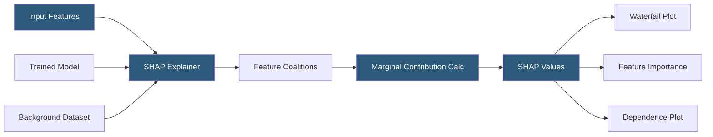

**Category:** AI Model Monitoring & Observability
**Difficulty:** Advanced
**Reading time:** 7 min read

---

SHAP (Shapley Additive Explanations) values provide mathematically grounded feature attributions for machine learning model predictions by computing each feature's contribution as its average marginal contribution across all possible feature subsets. The method unifies several existing feature importance approaches under a single theoretical framework.

- **Shapley value** — the average marginal contribution of a feature across all possible orderings of features, originating from cooperative game theory
- **SHAP value** — the specific implementation of Shapley values for machine learning, attributing each feature's contribution to the difference between the prediction and the expected prediction
- **TreeSHAP** — exact, polynomial-time SHAP algorithm for tree ensembles (XGBoost, LightGBM, scikit-learn forests)
- **KernelSHAP** — model-agnostic SHAP using weighted linear regression on permuted feature subsets for any black-box model
- **DeepSHAP** — SHAP for deep learning models using DeepLIFT propagation rules for efficient approximate computation
- **SHAP interaction values** — extension computing pairwise feature interaction contributions in addition to main effects
- **Base value** — the expected model prediction over the training dataset (E[f(x)]), the starting point from which SHAP attributions sum to the actual prediction

The core Shapley value computation considers all possible subsets of features. For each subset S not containing feature i, it computes the marginal contribution of adding feature i: f(S ∪ {i}) - f(S). The Shapley value for feature i is the weighted average of these marginal contributions across all possible subsets, where the weight accounts for the number of orderings in which a given subset can form. With n features, this requires evaluating 2^n subsets—exponential in the feature count.

TreeSHAP exploits the tree structure to compute exact Shapley values in O(TLD²) time, where T is the number of trees, L is maximum leaves, and D is maximum depth. For each prediction, it passes the instance through each tree, computing the contribution of each feature by comparing predictions with and without the feature using the conditional expectation over the background distribution. The tree structure makes these conditional expectations tractable without requiring sampling.

KernelSHAP samples feature coalitions (random subsets) and fits a weighted linear regression model to the coalition evaluations, using SHAP's coalition weighting scheme. The linear model coefficients are then the SHAP values. This is model-agnostic but requires many coalition evaluations to converge, making it slower than TreeSHAP.

SHAP interaction values extend the framework to compute pairwise interactions: for each feature pair (i, j), the interaction value represents the portion of the joint contribution not attributable to either feature independently. These require O(n²) values per prediction and are computationally expensive but valuable for diagnosing correlated feature effects.

The `shap` Python library provides a unified API for all variants, along with built-in visualization functions: summary plots (feature importance ranking), waterfall plots (per-prediction contribution breakdown), dependence plots (SHAP value vs feature value showing nonlinear effects), and force plots (interactive visualization of prediction composition).

- Computing feature importance for a gradient boosting fraud detection model using TreeSHAP
- Explaining an adverse credit decision by generating a SHAP waterfall plot for the denied applicant
- Monitoring feature importance drift in production by aggregating SHAP values over monitoring windows
- Debugging a neural network by applying DeepSHAP to identify which input regions activate unexpected predictions
- Auditing a model for potential bias by examining SHAP value patterns for protected attribute proxies

| Advantage | Disadvantage |
|-----------|--------------|
| Theoretical properties (local accuracy, consistency, missingness) ensure principled attributions | KernelSHAP convergence requires many model evaluations, making it impractical for large feature sets |
| TreeSHAP provides exact values for tree models in practical computation time | SHAP values are sensitive to correlated features: highly correlated features split attribution arbitrarily |
| Unified API supports multiple model types with consistent explanation output format | Background dataset selection affects SHAP values; different backgrounds produce different attributions |
| Built-in visualizations make explanations accessible to non-technical stakeholders | SHAP interaction values scale quadratically with feature count, limiting practical use for wide models |

- [LIME Explanations](lime-explanations.md)
- [Feature Importance Tracking](feature-importance-tracking.md)
- [Model Explainability Tools](model-explainability-tools.md)

---
*Part of the [AI Model Monitoring & Observability](index.md) category · [Back to Master Index](../../index.md)*
