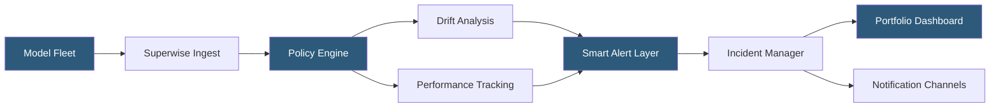

**Category:** AI Model Monitoring & Observability
**Difficulty:** Intermediate
**Reading time:** 6 min read

---

Superwise is a model observability platform built for enterprise ML teams managing large portfolios of production models. It provides centralized visibility across multiple models simultaneously, with automated policy generation and a no-code monitoring configuration interface designed to reduce MLOps operational burden at scale.

- **Model portfolio monitoring** — centralized dashboard tracking health status across dozens or hundreds of deployed models simultaneously
- **Automated policy** — monitoring rule automatically generated and calibrated based on model type and historical data statistics
- **Policy template** — reusable monitoring configuration applied consistently across models of the same type or business domain
- **Incident management** — structured workflow for alert triage, assignment, investigation, and resolution with audit trail
- **No-code configuration** — UI-driven monitoring setup enabling data scientists without platform engineering expertise to configure monitoring
- **Smart alerts** — alert filtering that suppresses known false positives and correlates related alerts into single incident notifications
- **Model performance index** — composite health score aggregating multiple monitoring metrics into a single model status indicator

Superwise addresses the operational scaling challenge that arises when organizations deploy dozens or hundreds of ML models. Managing monitoring configuration individually for each model becomes untenable—policy templates solve this by defining standard monitoring rules for model categories (fraud detection models, recommendation models, demand forecasting models) that are applied uniformly at registration time.

Automated policy generation analyzes the registered model's training data statistics, model type, and output distribution to infer appropriate monitoring thresholds without manual specification. For a binary classification model, Superwise automatically creates drift monitors for each feature, a prediction distribution monitor, and accuracy monitors (with configurable ground truth delay handling). Thresholds are calibrated against training data variance to minimize false positives.

Smart alerts reduce alert fatigue—a persistent challenge in multi-model environments. The platform uses alert grouping to consolidate related alerts (e.g., multiple features drifting simultaneously, which may all stem from the same upstream data change) into a single incident notification. It also tracks alert acknowledgment patterns to learn which alert types are typically resolved quickly versus which require extended investigation.

The incident management module provides a structured workflow: alerts auto-create incidents with severity classification, which are assigned to team members, tracked through investigation, and closed with resolution documentation. The audit trail satisfies compliance requirements for regulated industries and enables post-incident analysis to improve monitoring configuration.

The Model Performance Index aggregates configured metric scores into a single 0-100 composite health score per model, enabling portfolio-level triage: teams scan the index to identify which models require immediate attention without drilling into individual metric dashboards.

- Centralized model health dashboard for a data science team managing 50+ production models
- Standardizing monitoring policies across a model category using policy templates
- Reducing alert fatigue in high-volume serving environments through smart alert grouping
- Compliance documentation using incident management audit trails for regulated model deployments
- Rapid onboarding of new models to production monitoring using automated policy generation

| Advantage | Disadvantage |
|-----------|--------------|
| Policy templates enable consistent monitoring standards across large model portfolios | Template standardization may miss model-specific monitoring requirements |
| Smart alert grouping reduces operational noise from correlated drift events | Alert correlation logic can suppress genuine independent issues |
| No-code configuration reduces platform engineering expertise barrier | Advanced custom metric requirements may not be expressible through UI-only configuration |
| Portfolio-level health index enables rapid prioritization across many models | Composite health scores abstract away nuance in individual metric behaviors |

- [Censius AI Observability](censius-ai-observability.md)
- [Mona Labs Monitoring](mona-labs-monitoring.md)
- [Real-time Monitoring Dashboards](real-time-monitoring-dashboards.md)

---
*Part of the [AI Model Monitoring & Observability](index.md) category · [Back to Master Index](../../index.md)*
