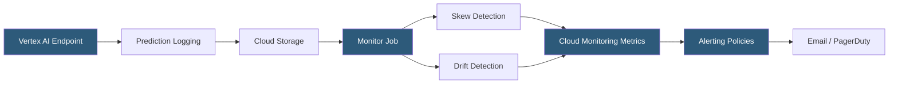

**Category:** AI Model Monitoring & Observability
**Difficulty:** Advanced
**Reading time:** 6 min read

---

Vertex AI Model Monitoring is Google Cloud's managed service for detecting data skew and drift in production ML models deployed on Vertex AI endpoints. It integrates with Google Cloud's operations suite (formerly Stackdriver) for alerting and provides native support for both tabular and feature store-based models.

- **Training-serving skew** — statistical divergence between feature distributions at training time versus production serving time
- **Prediction drift** — change in model output distribution over time without a stable training baseline comparison
- **Skew detection threshold** — configurable distance metric threshold (Jensen-Shannon, Chebyshev) triggering alerts for each feature
- **Drift detection threshold** — separate threshold for temporal drift in production data independent of training baseline
- **Feature Store integration** — Vertex AI Feature Store online serving statistics captured alongside model predictions
- **Email alert** — primary notification mechanism for Vertex AI monitoring alerts sent to configured recipients
- **Sampling rate** — percentage of production requests logged for monitoring analysis, balancing coverage against storage cost

Vertex AI Model Monitoring operates on endpoints deployed within Vertex AI Prediction. When a ModelDeploymentMonitoringJob is created and associated with an endpoint, prediction requests and responses are logged to a Google Cloud Storage bucket at the configured sampling rate.

Monitoring jobs run on a configurable schedule (minimum 1 hour intervals), analyzing the logged predictions against either a training dataset (for skew detection) or the previous monitoring window (for drift detection). The service computes Jensen-Shannon distance for numeric features and L-infinity distance for categorical features by default, with configurable alternative distance functions.

Threshold configuration is per-feature: different features can have different sensitivity levels based on their importance to model predictions and expected natural variance. Features with high natural variance (e.g., stock prices) require larger thresholds than stable features (e.g., customer account age).

Vertex AI Feature Store integration enables monitoring of features served from the online store directly—when features are retrieved from Feature Store for serving, their statistics are captured alongside the prediction event, providing monitoring across the full feature retrieval and serving path.

Alert notifications are published to Cloud Monitoring, where alerting policies can forward to email addresses, PagerDuty, Slack via webhook, or custom notification channels. Cloud Monitoring integration also enables creating unified alert dashboards combining model monitoring alerts with application and infrastructure signals.

The service handles schema validation automatically: if production requests contain features not present in the training schema, or if required features are missing, schema drift alerts fire before distribution-based drift analysis.

- Training-serving skew detection for models using Vertex AI Feature Store for feature serving
- Scheduled drift monitoring for batch prediction jobs serving large-scale production traffic
- Schema change detection when upstream systems modify feature data formats
- Organizations standardized on Google Cloud wanting native integration with existing Cloud Monitoring infrastructure
- Automated alerting for data pipeline failures manifesting as feature distribution shifts

| Advantage | Disadvantage |
|-----------|--------------|
| Native Vertex AI integration requires minimal configuration for endpoint-deployed models | Limited to models deployed on Vertex AI; other serving platforms require third-party tools |
| Cloud Monitoring integration enables unified observability with existing GCP infrastructure | Email-primary alerting is less sophisticated than purpose-built incident management platforms |
| Feature Store integration extends monitoring to the retrieval pipeline | Minimum 1-hour monitoring interval may be insufficient for high-velocity production applications |
| Managed service eliminates monitoring infrastructure operations | Configuration API complexity; some features require deep Vertex AI SDK familiarity |

- [SageMaker Model Monitor](sagemaker-model-monitor.md)
- [Azure ML Model Monitoring](azure-ml-model-monitoring.md)
- [Model Drift Detection](model-drift-detection.md)

---
*Part of the [AI Model Monitoring & Observability](index.md) category · [Back to Master Index](../../index.md)*
