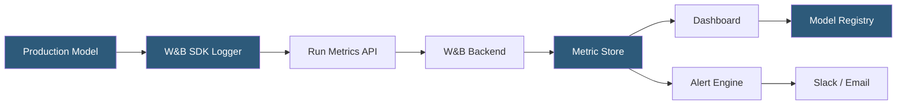

**Category:** AI Model Monitoring & Observability
**Difficulty:** Intermediate
**Reading time:** 6 min read

---

Weights & Biases (W&B) extends its experiment tracking platform into production model monitoring through W&B Launch and model registry integration. It provides a unified environment where the same tooling used during training (run logging, artifact versioning, metric visualization) extends naturally into production performance tracking.

- **W&B Run** — unit of work in W&B representing a training run, evaluation batch, or production monitoring window
- **Artifact** — versioned data object (model weights, datasets, evaluation results) with lineage tracking across runs
- **Model Registry** — versioned catalog of production-ready model candidates with lifecycle state management (Staging, Production, Archived)
- **W&B Launch** — job execution system enabling retraining, evaluation, and monitoring jobs to run on cloud compute from the W&B UI
- **Custom metrics** — user-defined scalar or histogram metrics logged to runs for domain-specific monitoring
- **Table** — W&B's rich data structure for logging prediction samples, images, and text with interactive visualization
- **Alert** — threshold-based notification triggered when a logged metric value crosses a configured boundary

W&B production monitoring uses the same `wandb.log()` API used during training, applied to batch prediction windows or streaming inference telemetry. Teams create a production monitoring run per time period (hourly, daily), logging aggregate metrics: prediction distribution statistics, accuracy (when ground truth is available), and custom business metrics.

The Model Registry tracks model lifecycle states with explicit promotion workflows. A model artifact transitions from Staging (evaluation complete, approved for production testing) to Production (serving live traffic) through a human-approval step. This creates an audit trail linking each production serving period to the specific model artifact and training run that produced it.

W&B Launch enables retraining automation directly from the monitoring workflow. When a monitoring run's metrics trigger an alert (accuracy below threshold), an engineer can trigger a retraining job via the W&B UI, which submits the training script to a configured compute target (AWS, GCP, Azure, or Kubernetes) with the latest data. Launch tracks the new training run with full lineage back to the monitoring alert that triggered it.

Tables enable rich sample logging: production batch runs can log prediction samples alongside input features and (when available) ground truth labels as W&B Tables. These interactive tables allow engineers to sort, filter, and inspect individual prediction records directly in the W&B UI without separate investigation tooling.

The W&B SDK's integration with major ML frameworks means teams using W&B for experiment tracking have minimal additional investment to extend monitoring to production—the same SDK, same API patterns, and same UI serve both workflows.

- Teams already using W&B for experiment tracking extending monitoring to production with the same tooling
- Model registry lifecycle management with human-approval promotion gates for production deployments
- Automated retraining triggered by monitoring alerts through W&B Launch
- Logging prediction samples from batch inference jobs as interactive tables for quality review
- End-to-end lineage tracking from training data through model version to production predictions

| Advantage | Disadvantage |
|-----------|--------------|
| Unified tooling eliminates context switching between training and production monitoring | Purpose-built monitoring platforms offer more advanced drift detection algorithms |
| Model Registry provides audit trail linking production behavior to training artifacts | Real-time streaming monitoring requires custom run management to handle continuous logging |
| Launch enables retraining automation from the monitoring UI without separate pipeline tooling | W&B is optimized for research and training workflows; production monitoring is a secondary use case |
| Team familiarity with W&B during training reduces production monitoring adoption friction | Cost scales with metric logging volume; high-frequency production monitoring can be expensive |

- [MLflow Model Monitoring](mlflow-model-monitoring.md)
- [SageMaker Model Monitor](sagemaker-model-monitor.md)
- [Model Version Comparison](model-version-comparison.md)

---
*Part of the [AI Model Monitoring & Observability](index.md) category · [Back to Master Index](../../index.md)*
