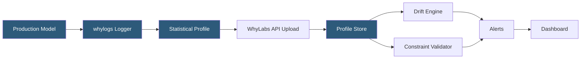

**Category:** AI Model Monitoring & Observability
**Difficulty:** Intermediate
**Reading time:** 6 min read

---

WhyLabs is an AI observability platform built around whylogs, an open-source data logging library that generates compact statistical profiles of datasets and model inputs/outputs. It enables continuous monitoring of data quality and model health without requiring raw data to leave the production environment.

- **whylogs** — open-source Python/Java library that generates lightweight statistical sketches (profiles) of data rather than storing raw records
- **DatasetProfile** — statistical summary object capturing distributions, missing values, cardinality, and schema information for a dataset snapshot
- **Constraint** — declarative data quality rule evaluated against a profile (e.g., no nulls in user_id, age between 0 and 120)
- **Monitor** — configured alert that evaluates profile statistics against baselines on a schedule
- **LLM guardrails** — WhyLabs LangKit integration providing toxicity, sentiment, topic relevance, and jailbreak detection for LLM applications
- **Privacy-preserving logging** — logging statistical summaries rather than raw PII-containing data, enabling observability in regulated industries
- **Segment** — sub-population filter applied to profiles for disaggregated analysis by feature value or metadata tag

WhyLabs' key architectural differentiator is statistical profiling rather than raw data logging. The whylogs library instruments model inference pipelines to generate profiles—compact data structures (typically kilobytes, not gigabytes) that capture sufficient statistics for distribution comparison, anomaly detection, and data quality validation. Because raw data never leaves the serving environment, WhyLabs is particularly suited to healthcare, finance, and other regulated domains where data egress is restricted.

Profiles include: count, null count, mean, standard deviation, histogram buckets for numeric columns; frequency counters and cardinality estimates for categorical columns; and schema type information. For text and NLP features, LangKit extends profiling to include sentiment scores, text statistics (word count, character count), regex pattern match rates, and embedding-based semantic similarity to reference texts.

The WhyLabs platform stores time-series of profiles, computing drift metrics by comparing current-period profiles against a baseline profile. Monitoring uses statistical distance measures including the Hellinger distance and KL divergence for numeric features, and total variation distance for categorical features. Users define Monitors in a YAML configuration or via the UI, specifying metric, baseline, threshold, and notification channel.

For LLM monitoring, WhyLabs LangKit wraps LangChain and direct API calls to automatically extract quality signals from every request-response pair: response length, blocked content rates, prompt injection indicators, and semantic drift from the expected response topic distribution.

- HIPAA-compliant monitoring of a clinical NLP model without exposing patient data to a third-party service
- Detecting data quality regressions in ML feature pipelines through automated constraint validation
- Monitoring LLM chatbot tone drift and off-topic response rates in a customer service application
- Validating data quality at each stage of a multi-step ETL pipeline feeding a recommendation model
- Financial services fraud detection monitoring with statistical profiles that satisfy data residency requirements

| Advantage | Disadvantage |
|-----------|--------------|
| Privacy-preserving profiling enables monitoring in regulated industries | Statistical summaries lose information; rare event detection requires raw data |
| whylogs open-source core avoids vendor lock-in for the logging layer | Profile-based monitoring cannot replay historical raw data for deep investigation |
| LangKit provides out-of-the-box LLM quality metrics without custom implementation | Constraint and monitor configuration requires upfront investment in data quality documentation |
| Lightweight profiles reduce storage and egress costs vs raw prediction logging | Some drift algorithms are less powerful than those requiring access to raw records |

- [Whylabs Data Quality Monitoring](whylabs-data-quality-monitoring.md)
- [Evidently AI Monitoring](evidently-ai-monitoring.md)
- [LangSmith LLM Monitoring](langsmith-llm-monitoring.md)

---
*Part of the [AI Model Monitoring & Observability](index.md) category · [Back to Master Index](../../index.md)*
