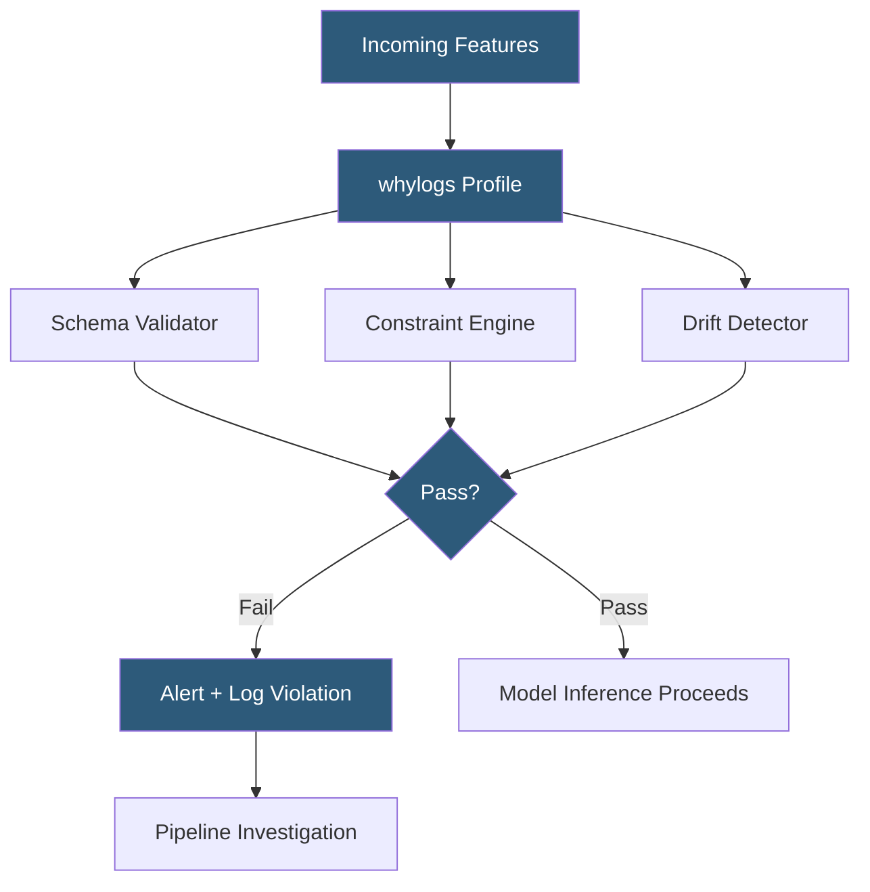

**Category:** AI Model Monitoring & Observability
**Difficulty:** Intermediate
**Reading time:** 6 min read

---

WhyLabs data quality monitoring uses whylogs statistical profiles to continuously validate incoming model feature data against declared schema and distribution expectations. It catches upstream data pipeline failures, feature drift, and encoding errors before they silently degrade model predictions.

- **Schema validation** — automated type and format checks ensuring features arrive in expected data types
- **Null rate constraint** — rule declaring acceptable percentage of missing values per feature column
- **Range constraint** — declarative bound check ensuring numeric features fall within expected min/max values
- **Cardinality constraint** — limit on the number of unique values in categorical features, flagging unexpected expansion
- **Distribution constraint** — statistical test validating that a feature's distribution matches a reference snapshot
- **Freshness check** — validation that data arrives within expected time windows, detecting delayed pipelines
- **Reference profile** — baseline statistical snapshot (typically from training data) against which production profiles are compared

WhyLabs data quality monitoring operates through whylogs' `DatasetConstraints` API, where users declare expectations about their data as Python code or YAML configuration. Constraints compile into validation rules applied against each profile generated at inference time. A constraint violation creates a `ConstraintResults` object capturing which constraint failed, the actual observed value, and the expected bound.

The platform supports hierarchical constraint organization: table-level constraints (row count bounds, overall null rates) and column-level constraints (type checks, range bounds, allowed value sets). Columns can be grouped into semantic categories—e.g., "user features," "item features," "context features"—enabling batch validation with shared thresholds.

Reference profiles generated from training data serve as the baseline for distribution constraints. At each evaluation cycle, the platform computes Hellinger distance or PSI between the current production profile and the reference. Thresholds are configurable per column based on the column's expected variance.

WhyLabs integrates with Apache Airflow, Prefect, and MLflow through callbacks that log profiles at each pipeline stage (raw data ingestion, feature transformation, model serving). This enables pinpointing exactly which pipeline step introduced a quality issue rather than discovering it only at the model output level.

Alerting integrates with standard DevOps notification channels (PagerDuty, Opsgenie, Slack) with configurable severity levels. Critical constraints (null user IDs reaching inference) trigger immediate paging; warning constraints (slight distribution drift in secondary features) route to low-priority Slack notifications for batch review.

- Validating that a real-time recommendation system receives correctly encoded user embeddings after a feature engineering change
- Detecting when a third-party data feed begins returning nulls in a key categorical feature
- Ensuring that feature values stay within physically meaningful ranges (e.g., purchase amount > 0)
- Monitoring feature pipeline latency by checking data freshness at model serving time
- Automated pre-production data quality gate in CI/CD preventing deployment of new models with degraded training data

| Advantage | Disadvantage |
|-----------|--------------|
| Declarative constraints document data expectations as executable specifications | Constraint authoring requires thorough understanding of acceptable data ranges |
| Profile-based validation runs at logging time with minimal latency overhead | Statistical constraints have inherent false positive rates at strict significance levels |
| Pipeline-stage granularity accelerates root cause identification | Cardinality and null rate checks require calibration for high-cardinality features |
| Integration with orchestration platforms enables end-to-end data lineage | Constraint maintenance overhead grows with model feature set size |

- [Whylabs AI Observability](whylabs-ai-observability.md)
- [Data Drift Analysis](data-drift-analysis.md)
- [Evidently Test Suites](evidently-test-suites.md)

---
*Part of the [AI Model Monitoring & Observability](index.md) category · [Back to Master Index](../../index.md)*
