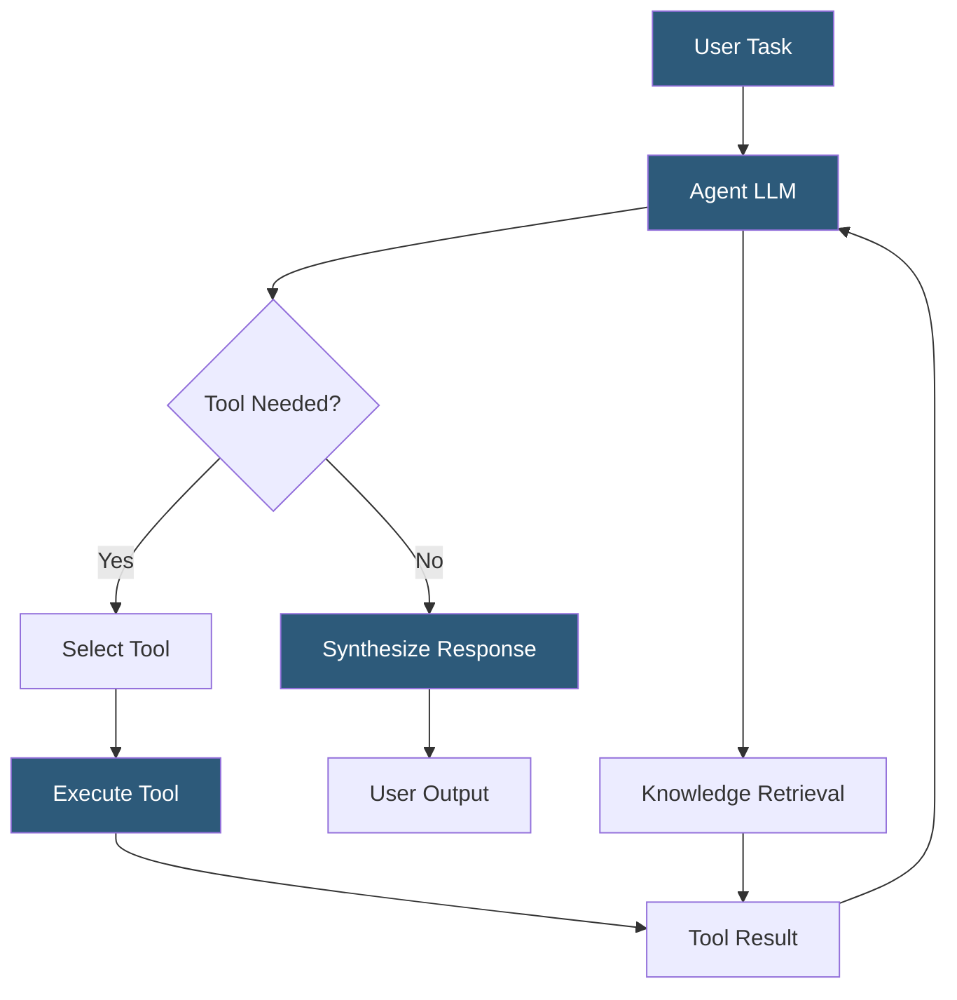

**Category:** AI Workflow & Orchestration Tools
**Difficulty:** Intermediate
**Reading time:** 6 min read

---

Dify's agent orchestration enables building AI agents that autonomously plan and execute multi-step tasks using tools, knowledge retrieval, and LLM reasoning. It supports both ReAct and Function Calling inference modes and provides a visual configuration interface for assembling agents with mixed tool and knowledge source capabilities.

- **Agent inference mode** — the reasoning strategy the agent uses: Function Calling (structured tool dispatch via model native API) or ReAct (reasoning-action loop via prompt engineering)
- **Built-in tool** — pre-integrated capabilities like web search, Wikipedia, Wolfram Alpha, and code execution available without custom integration
- **Custom tool** — user-defined OpenAPI schema describing an external REST endpoint the agent can call
- **Tool authorization** — credential management for tools requiring API keys, handled through Dify's tool provider configuration
- **Long context memory** — conversation summary compression enabling agent sessions to continue beyond context window limits
- **Max iterations** — safety limit preventing infinite agent loops when task completion is unreachable
- **Agent output** — the final synthesized response the agent delivers after completing its reasoning-action sequence

Dify agent orchestration works through an Agent app type where the central LLM reasoning loop has access to a configured set of tools and knowledge bases. Function Calling mode is preferred when the underlying model supports structured function/tool calling (OpenAI, Anthropic, and most recent open models do). In this mode, the agent declares available tools as function schemas to the model, and the model returns structured JSON tool call specifications that Dify executes.

ReAct mode is used for models that don't support native function calling, implementing the reasoning-action loop through prompt engineering: the system prompt instructs the model to output thoughts, actions, and observations in a specific text format that Dify parses to detect and execute tool calls.

Built-in tools provide immediate capability without integration work. The web search tool connects to providers like SerpAPI or Bing Search API (requires API key configuration). The code interpreter tool executes Python code in a sandboxed environment, enabling the agent to perform data analysis and computation. The DallE tool generates images. Wikipedia and Wolfram Alpha tools provide encyclopedic and computational knowledge.

Custom tools use OpenAPI schema definitions: the user provides a URL to an OpenAPI (Swagger) specification file or enters the schema manually. Dify parses the schema and creates tool definitions for each API endpoint, enabling the agent to call the API with generated parameters. Authorization credentials are stored per-tool provider and injected at execution time.

Long-context memory management is critical for multi-turn agent sessions. When conversation history approaches the model's context limit, Dify applies a summarization step to compress older history, maintaining semantic continuity while fitting within context constraints.

- Building a research agent that searches the web, retrieves internal knowledge base documents, and synthesizes reports
- Creating a data analysis agent that writes and executes Python code to process uploaded datasets
- Deploying a customer service agent that queries CRM APIs for customer information during conversations
- Implementing a coding assistant agent that searches documentation and tests generated code
- Building a scheduling agent that calls calendar APIs to find availability and book meetings

| Advantage | Disadvantage |
|-----------|--------------|
| Function Calling mode provides structured tool dispatch more reliable than ReAct prompt parsing | Agent reliability depends heavily on the underlying LLM's function calling quality |
| Built-in tools reduce integration effort for common agent capabilities | Custom tool debugging requires examining raw HTTP request/response in tool execution logs |
| Knowledge base integration in agents enables seamless RAG alongside tool use | Max iteration limits can truncate multi-step tasks that require many tool calls |
| OpenAPI-based custom tool definition leverages existing API documentation | Agents are non-deterministic; same input may produce different tool call sequences |

- [Dify.ai LLM App Development](dify-ai-llm-app-development.md)
- [Dify Knowledge Base Integration](dify-knowledge-base-integration.md)
- [Flowise Agent Flows](flowise-agent-flows.md)

---
*Part of the [AI Workflow & Orchestration Tools](index.md) category · [Back to Master Index](../../index.md)*
