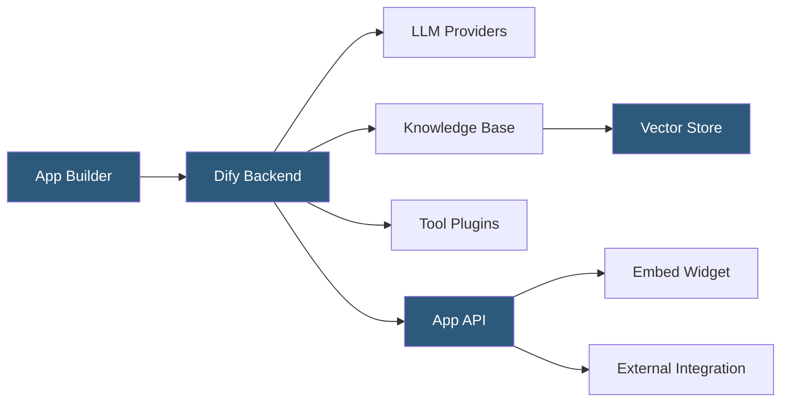

**Category:** AI Workflow & Orchestration Tools
**Difficulty:** Intermediate
**Reading time:** 6 min read

---

Dify.ai is an open-source LLM application development platform that combines a visual workflow builder, prompt engineering tools, RAG pipeline management, and agent orchestration into a unified interface. It provides both cloud and self-hosted deployment options, with an emphasis on production-ready LLM application lifecycle management.

- **App** — the fundamental unit in Dify representing a deployable LLM application (chatbot, agent, workflow, or text generator)
- **Workflow** — Dify's node-based pipeline editor for building complex multi-step LLM processing chains
- **Knowledge** — Dify's document management system for creating and managing RAG knowledge bases
- **Model provider** — integrated LLM API connection supporting 50+ models from OpenAI, Anthropic, Cohere, local Ollama, and others
- **Plugin** — tool extension enabling agents to call external APIs and services
- **Application analytics** — built-in usage tracking, token consumption, and conversation logging
- **API publishing** — each Dify app is automatically backed by a REST API for programmatic integration

Dify organizes development around App entities with four types: Chatbot (conversational interface), Agent (tool-using autonomous system), Workflow (structured multi-step pipeline), and Text Generator (single-turn completion). Each type provides a tailored development interface for the use case.

The Workflow editor uses a node-based canvas similar to Flowise and Langflow but with a stronger emphasis on conditional logic and data transformation. Workflow nodes include LLM (invoke an LLM with a prompt), Knowledge Retrieval (search a knowledge base), Code (execute Python or JavaScript), HTTP Request (call external APIs), IF/ELSE (conditional branching), and Iterator (loop over a list). This broader node vocabulary enables expressing more complex application logic visually.

Knowledge management is a standout Dify feature. The platform provides a full document ingestion pipeline: users upload files (PDF, Word, Markdown, web pages), configure chunking parameters, select an embedding model, and Dify handles the text extraction, chunking, embedding, and vector storage automatically. Multiple knowledge bases can be created and independently managed, then attached to apps as retrieval sources.

Multi-model support with a unified model provider abstraction allows apps to reference models by capability tier rather than specific model names, enabling switching providers without workflow changes. The model provider system normalizes API differences across dozens of providers.

Dify Cloud offers a hosted version with team collaboration, usage dashboards, and managed infrastructure. The self-hosted version (Docker Compose deployment) provides full data control for enterprise environments with data residency requirements.

- Building an enterprise internal chatbot connected to multiple company knowledge bases
- Creating a content generation workflow that retrieves relevant brand guidelines before writing
- Deploying an AI customer service agent with integrated CRM plugin tools
- Managing prompt template versions and A/B testing them through Dify's prompt management interface
- Self-hosting an LLM application platform for a healthcare organization with strict data requirements

| Advantage | Disadvantage |
|-----------|--------------|
| Integrated knowledge management reduces RAG pipeline setup from days to minutes | Visual workflow editor less extensible than code-based frameworks for advanced use cases |
| 50+ model provider support enables multi-model and fallback strategies | Self-hosted deployment complexity is higher than simpler single-service tools |
| Built-in analytics provide usage and cost visibility without additional tooling | Platform abstraction may limit access to provider-specific advanced features |
| Embed widget enables deploying chatbots on external websites without custom frontend | Commercial Dify Cloud pricing scales with usage; heavy usage can exceed budget expectations |

- [Dify Agent Orchestration](dify-agent-orchestration.md)
- [Dify Knowledge Base Integration](dify-knowledge-base-integration.md)
- [Flowise Low-Code LLM Apps](flowise-low-code-llm-apps.md)

---
*Part of the [AI Workflow & Orchestration Tools](index.md) category · [Back to Master Index](../../index.md)*
