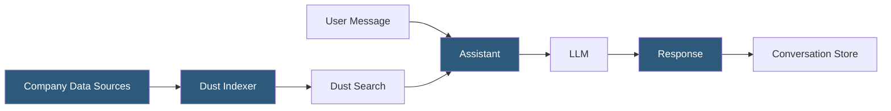

**Category:** AI Workflow & Orchestration Tools
**Difficulty:** Intermediate
**Reading time:** 6 min read

---

Dust.tt is an enterprise AI assistant platform that enables teams to create custom AI assistants connected to company data sources. It focuses on making organizational knowledge accessible through AI through managed data connections to tools like Notion, Slack, Google Drive, GitHub, and Confluence.

- **Assistant** — a configured AI agent in Dust with a system prompt, data source connections, and optional tool capabilities
- **Data source** — a connected external service from which Dust indexes content for assistant retrieval
- **Space** — organizational scope within Dust (Public, Restricted, or Private) controlling which assistants and data sources are visible to which users
- **Actions** — capabilities granted to an assistant beyond text generation: retrieval, web search, data querying, code execution
- **Conversation** — a multi-turn interaction session with an assistant, stored for future reference
- **Dust API** — programmatic interface for integrating Dust assistants into external applications and workflows
- **Builder** — the configuration interface for creating and editing assistants, defining their persona, instructions, and capabilities

Dust's data connection architecture is its primary differentiator. The platform provides native connectors to enterprise knowledge systems: Notion pages, Slack channel messages, Google Drive documents, GitHub repositories, Confluence spaces, and Intercom conversations. These connectors perform incremental synchronization—new and updated content is indexed automatically on a configured schedule.

When a user sends a message to an assistant with data source connections, Dust performs semantic search across the indexed content to retrieve relevant context before generating a response. The retrieval is transparent: the UI shows which source documents were retrieved alongside the assistant's response, enabling users to verify information provenance.

Assistant builders configure personas through a detailed instruction prompt that shapes the assistant's behavior, communication style, and scope. Instructions can specify which topics the assistant should focus on, which it should decline to answer, and how it should handle uncertainty (directing users to human experts when confidence is low).

Spaces provide organizational access control: company-wide Public assistants are accessible to all employees, Restricted spaces contain department-specific assistants and data, and Private spaces allow individual users to build personal assistants.

The Dust API enables embedding assistant capabilities in other workflows: a Slack bot forwarding messages to a Dust assistant, an internal tool triggering an assistant to analyze a document, or a customer-facing product incorporating Dust-powered Q&A.

Model selection is configurable per assistant: Dust supports multiple providers (OpenAI, Anthropic, Mistral) and allows different assistants to use different models based on their capability requirements.

- Engineering assistant connected to GitHub and Confluence that answers code architecture questions
- HR assistant indexed against HR policies and benefits documentation answering employee queries
- Sales assistant connected to Salesforce and product documentation for deal preparation support
- Customer support assistant retrieving from Intercom conversation history and product documentation
- Executive assistant with access to company OKRs and strategy documents for meeting preparation

| Advantage | Disadvantage |
|-----------|--------------|
| Native enterprise data connectors reduce integration development effort significantly | Data indexing has latency; very recent changes may not yet be searchable |
| Source citation in responses builds user trust and enables verification | Platform is SaaS-only; organizations with strict data residency requirements cannot self-host |
| Spaces access control maps naturally to organizational team structures | Connector coverage is limited to supported platforms; custom data sources require API ingestion |
| Configurable models per assistant enables cost optimization by task type | Pricing scales with user seats and data volume; may be expensive for large organizations |

- [Dust.tt Data Source Connections](dust-tt-data-source-connections.md)
- [Relevance AI Agent Builder](relevance-ai-agent-builder.md)
- [Cassidy.ai AI Workforce Platform](cassidy-ai-ai-workforce-platform.md)

---
*Part of the [AI Workflow & Orchestration Tools](index.md) category · [Back to Master Index](../../index.md)*
