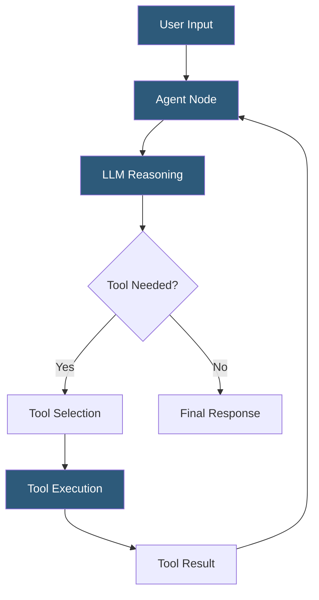

**Category:** AI Workflow & Orchestration Tools
**Difficulty:** Intermediate
**Reading time:** 6 min read

---

Flowise agent flows enable building AI agents that autonomously use tools, access external data sources, and complete multi-step tasks through a visual workflow interface. They implement agent patterns (ReAct, Function Calling, OpenAI Assistants) as configurable node graphs, making agent development accessible without deep LangChain expertise.

- **Agent node** — the central orchestration component that manages the LLM-tool interaction loop
- **Tool node** — a function the agent can invoke to take actions (web search, calculator, API caller, code executor)
- **ReAct agent** — agent pattern alternating between Reasoning (thinking about what tool to use) and Acting (calling the tool)
- **OpenAI Functions agent** — agent using OpenAI's function calling API for structured tool dispatch
- **Multi-agent flow** — Flowise workflow connecting multiple agents with handoff capabilities
- **Agent scratchpad** — the agent's working memory storing the reasoning and tool call history within a session
- **Tool schema** — JSON schema definition describing a tool's input parameters, enabling the LLM to generate valid tool calls

Flowise agent flows are built by placing an Agent node on the canvas and connecting Tool nodes to its "Tools" input. The Agent node wraps a LangChain agent executor, which manages the iterative LLM-tool loop: the LLM receives the user message and tool descriptions, reasons about which tool to call, the engine executes the tool, and the result is fed back to the LLM for the next reasoning step.

Tool nodes come in several varieties: Calculator (evaluates arithmetic expressions), SerpAPI (web search), WebBrowser (browse URLs), Custom Tool (calls a user-defined API endpoint), and Code Interpreter (executes Python code). Custom Tool nodes accept a name, description, and API URL, enabling the agent to call any REST endpoint described as a tool.

The agent loop continues until the LLM generates a final answer (determined by the absence of a tool call in the reasoning output) or until the configured maximum iteration limit is reached. The maximum iterations limit prevents infinite loops in cases where the agent gets confused or the tool returns unexpected results.

Memory can be attached to agent flows to maintain conversation context across turns. Buffer Memory stores the full conversation history. Buffer Window Memory keeps only the last N messages. Zep Memory uses a long-term memory store for persistent context across sessions.

Multi-agent flows connect multiple agent nodes with routing logic: a Supervisor agent can dispatch subtasks to specialized worker agents (a research agent, a writing agent, a data analysis agent) and synthesize their outputs into a final response. This pattern mirrors organizational delegation structures for complex knowledge work tasks.

- Building a customer support agent that searches a knowledge base and escalates to human agents when confidence is low
- Research assistant that performs web searches, reads articles, and synthesizes findings
- Data analysis agent that writes and executes Python code to analyze uploaded CSV files
- Multi-agent workflow where a coordinator routes customer queries to specialized product or billing agents
- Developer productivity tool that searches documentation and generates code snippets for specific API questions

| Advantage | Disadvantage |
|-----------|--------------|
| Visual tool-agent connection makes agent architecture immediately understandable | Debugging agent reasoning loops is harder in visual mode than in code-based frameworks |
| Pre-built tools (search, browser, calculator) reduce integration development time | Complex tool schemas with nested parameters are difficult to configure through the UI |
| Max iteration limits prevent runaway agent loops | Agent performance is bounded by underlying LangChain agent capabilities |
| Multi-agent patterns enable task delegation without custom orchestration code | Visual agent flows have limited support for dynamic tool selection at runtime |

- [Flowise Low-Code LLM Apps](flowise-low-code-llm-apps.md)
- [Dify Agent Orchestration](dify-agent-orchestration.md)
- [Relevance AI Agent Builder](relevance-ai-agent-builder.md)

---
*Part of the [AI Workflow & Orchestration Tools](index.md) category · [Back to Master Index](../../index.md)*
