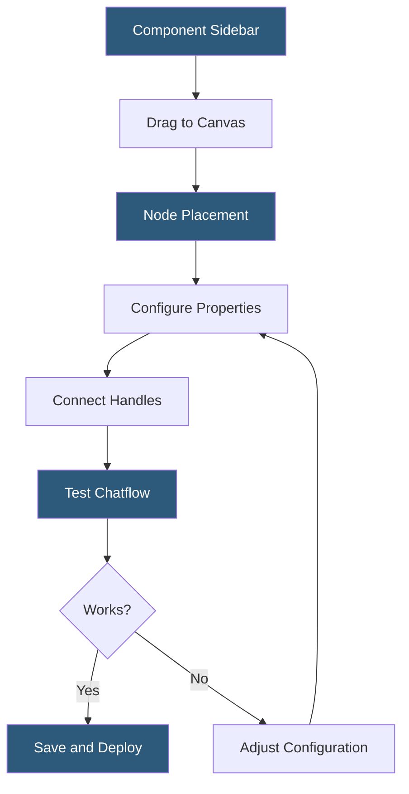

**Category:** AI Workflow & Orchestration Tools
**Difficulty:** Beginner
**Reading time:** 5 min read

---

The Flowise drag-and-drop builder is the visual canvas interface that enables constructing LLM workflows by connecting pre-built component nodes. It provides an intuitive workflow design experience that removes the need to write LangChain boilerplate, making LLM application development accessible to a broader audience.

- **Canvas** — the infinite scrolling workspace where nodes are placed and connected to form a workflow
- **Sidebar** — the component library panel listing available node categories (LLMs, Chains, Agents, Memory, Tools, Vector Stores, Embeddings)
- **Node handle** — the input/output connector points on each node that accept specific data types
- **Wire** — the visual connection between node handles defining data flow direction
- **Configuration panel** — the properties editor appearing when a node is selected, exposing its configurable parameters
- **Zoom and pan** — canvas navigation controls for working with complex multi-node workflows
- **Minimap** — small overview panel showing the full canvas layout for navigation in large workflows

The drag-and-drop builder renders as a React Flow-based canvas in the browser. The component sidebar organizes available nodes into categories. Each node is defined by a JSON schema declaring its input types, output types, and configurable parameters. When dragged onto the canvas, the node renders with its input and output handles based on its schema.

Type-compatible connections are visually indicated during dragging: handles turn green when a compatible output is hovering over an input, and red when types are incompatible. This type safety guidance prevents common misconfiguration errors like connecting a string output to a document list input.

Configuration panels render form controls appropriate to each parameter type: dropdowns for enumerated values (model selection), text fields for strings (API keys, prompts), number sliders for numeric parameters (temperature, max tokens), and toggles for boolean settings. Credentials can be stored globally in Flowise and referenced by name, avoiding repeated API key entry across multiple nodes.

The built-in chat panel at the bottom of the editor enables testing the workflow interactively without leaving the builder. This immediate feedback loop accelerates iteration—users can type a test message and see the workflow execute in real time, observing intermediate node outputs when debug mode is enabled.

Canvas organization features include node grouping through visual proximity, sticky notes for documentation, and color coding of node categories. For complex workflows, these help maintain readability as the number of nodes grows beyond 10-20 components.

- Building a complete RAG chatbot by dragging and connecting a PDF loader, text splitter, embeddings, vector store, and QA chain nodes
- Visual debugging of LLM pipeline failures by inspecting intermediate node outputs
- Teaching LLM application architecture by showing the component dependency graph visually
- Rapid iteration on prompt templates by editing text fields and re-testing without code changes
- Onboarding new team members to existing LLM workflow architecture through the visual representation

| Advantage | Disadvantage |
|-----------|--------------|
| Visual connection graph shows data flow architecture immediately | Canvas navigation becomes cumbersome for workflows with 30+ nodes |
| Type-safety hints on handles reduce common configuration errors | Debug mode for intermediate outputs can be confusing for multi-path flows |
| Inline chat testing eliminates context switching between editor and test environments | No version control for individual node configurations within the canvas |
| Credential management prevents API key duplication across nodes | Complex conditional logic requiring branching exceeds visual builder capabilities |

- [Flowise Low-Code LLM Apps](flowise-low-code-llm-apps.md)
- [Flowise Agent Flows](flowise-agent-flows.md)
- [Langflow Visual LangChain Builder](langflow-visual-langchain-builder.md)

---
*Part of the [AI Workflow & Orchestration Tools](index.md) category · [Back to Master Index](../../index.md)*
