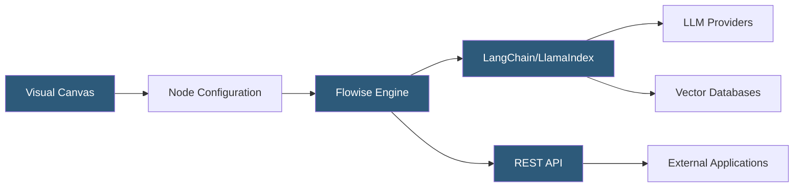

**Category:** AI Workflow & Orchestration Tools
**Difficulty:** Beginner
**Reading time:** 5 min read

---

Flowise is an open-source, low-code platform for building LLM-powered applications through a visual drag-and-drop interface. It abstracts the complexity of LangChain and LlamaIndex into reusable visual components, enabling developers and non-engineers to build chatbots, RAG pipelines, and AI agents without writing extensive code.

- **Chatflow** — a visual workflow representing an LLM-powered application, composed of connected nodes on a canvas
- **Node** — a functional unit in Flowise representing a component (LLM, memory, retriever, tool) that can be connected to other nodes
- **Integration** — pre-built connectors to LLM APIs (OpenAI, Anthropic, Ollama), vector databases, and external services
- **API endpoint** — each deployed chatflow exposes a REST API that applications can call to invoke the workflow
- **Prediction** — the act of sending an input message to a chatflow and receiving the LLM-generated response
- **Custom tool** — user-defined function node enabling the chatflow to call external APIs or execute custom code
- **Template** — pre-built chatflow configurations for common use cases (basic chatbot, document QA, agent with tools)

Flowise runs as a Node.js server that serves both the visual editor frontend and the chatflow execution engine. The server can be self-hosted via Docker or npm, or deployed to cloud platforms. The visual canvas allows building LLM workflows by dragging component nodes (LLMs, prompts, memory, vector stores, chains, agents) onto a canvas and connecting them.

Each node type encapsulates a LangChain or LlamaIndex component, rendering its configurable properties in a sidebar panel. An OpenAI Chat Model node exposes model selection, temperature, and API key. A Pinecone Vector Store node exposes index name, namespace, and embedding model configuration. Connections between nodes define the data flow: connecting a Retriever node's output to a Conversational Retrieval QA Chain node's document input creates a RAG pipeline.

When a chatflow is saved, Flowise serializes the graph structure and stores it. When the chatflow's API endpoint receives a request, the execution engine deserializes the graph, instantiates each node's underlying LangChain component with the configured parameters, and executes the chain in topological order.

The platform supports streaming responses, enabling real-time output token delivery to calling applications. Memory nodes (Buffer Memory, Redis Memory) maintain conversation history across turns, enabling multi-turn chatbot applications without client-side history management.

Flowise also supports agent workflows where the LLM uses tools (web search, calculators, custom API callers) through a ReAct or Function Calling agent pattern, with the tool execution handled by the Flowise engine between LLM calls.

- Rapid prototyping of LLM application ideas without full-stack development setup
- Building internal knowledge base Q&A chatbots using document ingestion and RAG nodes
- Creating AI agent workflows that combine web search with document retrieval
- Non-technical team members experimenting with LLM application configurations
- Embedding an AI assistant into existing applications through Flowise's REST API

| Advantage | Disadvantage |
|-----------|--------------|
| Visual interface dramatically reduces time-to-prototype for LLM applications | Complex logic requiring custom branching or loops is difficult to express visually |
| Self-hostable open-source version enables data privacy and cost control | Performance ceiling for high-scale production workloads is lower than custom-coded solutions |
| Pre-built node templates reduce the LangChain/LlamaIndex learning curve | Node abstraction hides implementation details that matter for advanced optimization |
| REST API integration enables embedding Flowise chatflows in existing applications | Self-hosted deployment requires Node.js infrastructure management |

- [Flowise Drag-and-Drop Builder](flowise-drag-and-drop-builder.md)
- [Flowise Agent Flows](flowise-agent-flows.md)
- [Langflow Visual LangChain Builder](langflow-visual-langchain-builder.md)

---
*Part of the [AI Workflow & Orchestration Tools](index.md) category · [Back to Master Index](../../index.md)*
