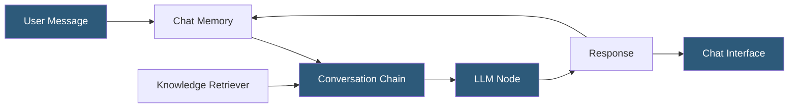

**Category:** AI Workflow & Orchestration Tools
**Difficulty:** Beginner
**Reading time:** 5 min read

---

FlowiseAI's chatflow builder is the core interface for creating conversational LLM pipelines in Flowise, specifically optimized for multi-turn chat applications. It differs from general workflow builders by focusing on the conversational context management, memory integration, and streaming response patterns essential for chatbot development.

- **Chatflow** — a Flowise workflow type optimized for multi-turn conversational applications with built-in message history management
- **Conversational chain** — a LangChain chain type that maintains conversation history, reformulates follow-up questions with context
- **Chat memory** — component providing conversation history storage and retrieval for maintaining context across turns
- **Starter prompt** — optional introductory message displayed when a user opens a chat session
- **Follow-up prompt suggestions** — configurable suggested follow-up messages displayed after AI responses
- **Streaming** — real-time token delivery to the chat interface as the LLM generates output
- **Embed widget** — JavaScript snippet for embedding the Flowise chat interface into external websites

A Flowise chatflow is built around a Conversational chain node that manages the multi-turn interaction pattern. The chain receives the user's current message along with the conversation history from the attached memory component, passes them to the LLM, and returns the response. The response is both returned to the caller and stored in memory for the next turn.

The memory component is critical for chatflow functionality. Without memory, each message is processed independently without awareness of prior conversation. Flowise supports several memory types: Buffer Memory (full history), Buffer Window Memory (last N messages), Summary Memory (LLM-generated conversation summary), and Redis Backed Chat Memory (persistent across server restarts).

Chatflows can incorporate retrieval by connecting a Vector Store Retriever node to the chain. In this RAG chatflow configuration, the user's question is also used to retrieve relevant documents, which are included as context in the LLM prompt alongside the conversation history. The chain's reformulation step rewrites follow-up questions to be standalone (removing pronouns and resolving references) before the retrieval step.

The Flowise Embed widget allows deploying chatflows as embeddable chat interfaces on external websites. The widget code is generated in the Flowise UI after saving a chatflow and accepting an API key configuration. The embedded chat communicates with the Flowise server API, requiring the server to be publicly accessible.

Streaming responses are enabled by default in Flowise chatflows, with the interface showing tokens as they arrive rather than waiting for the complete response. This provides a ChatGPT-like experience where the response appears progressively.

- Customer-facing chatbot on a company website answering product questions with knowledge base retrieval
- Internal IT helpdesk chatbot with persistent memory tracking user-reported issues across sessions
- Educational assistant maintaining conversation context while tutoring students
- Multi-turn interview practice bot that references earlier answers in follow-up questions
- FAQ chatbot with suggested follow-up questions guiding users to related information

| Advantage | Disadvantage |
|-----------|--------------|
| Purpose-built for conversational patterns with built-in memory management | Limited to conversational use cases; complex pipelines need the general workflow mode |
| Embed widget enables non-engineer deployment to existing websites | Publicly accessible server is required for embed widget; security configuration is non-trivial |
| Streaming response delivery provides modern chat UX without custom frontend development | Memory accumulation over long conversations can approach context limits, requiring memory strategy selection |
| Starter prompts and follow-up suggestions improve user onboarding experience | Conversation history storage in databases requires Redis or other persistent backend configuration |

- [Flowise Low-Code LLM Apps](flowise-low-code-llm-apps.md)
- [Flowise Agent Flows](flowise-agent-flows.md)
- [Dify.ai LLM App Development](dify-ai-llm-app-development.md)

---
*Part of the [AI Workflow & Orchestration Tools](index.md) category · [Back to Master Index](../../index.md)*
