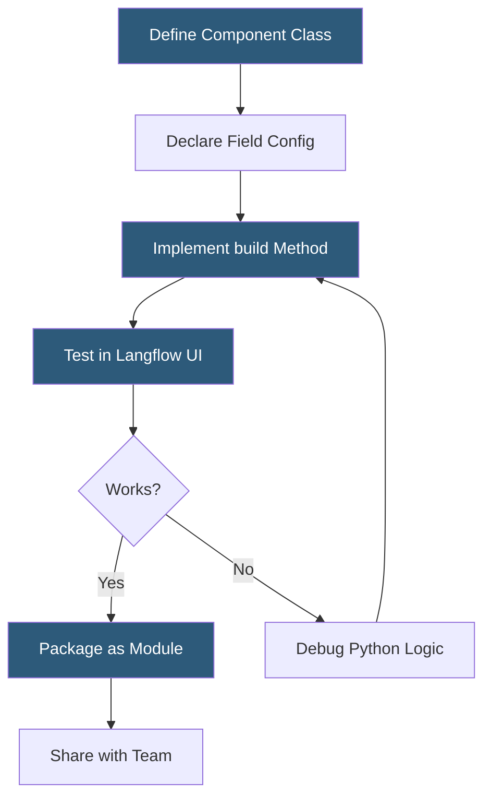

**Category:** AI Workflow & Orchestration Tools
**Difficulty:** Advanced
**Reading time:** 6 min read

---

Langflow component customization enables developers to extend the visual workflow builder with custom Python logic, proprietary integrations, and specialized processing nodes. Custom components allow teams to encapsulate complex business logic within the visual canvas without forking the platform or writing routing code outside of Langflow.

- **CustomComponent base class** — Langflow's abstract base class that custom components must extend, providing the framework for canvas integration
- **build() method** — the required method in a custom component that receives input values and returns a LangChain-compatible output object
- **field_config** — class-level configuration dictionary declaring input field names, types, display labels, and default values
- **FieldConfig** — Langflow's typed configuration class for declaring individual field metadata
- **Component inputs** — declared parameters that appear as configurable fields in the node's properties panel and optionally as connectable handles
- **Component outputs** — declared return types that appear as output handles, defining what downstream nodes can receive
- **Dynamic fields** — input fields that appear or change based on values in other fields, enabling conditional configuration UIs

A Langflow custom component is a Python module placed in Langflow's custom components directory (or loaded via the `LANGFLOW_COMPONENTS_PATH` environment variable). Langflow scans this directory at startup and registers discovered components.

The minimal custom component structure requires extending `CustomComponent`, defining a `display_name`, `description`, and `documentation` class attribute, declaring `field_config` as a dictionary mapping field names to their configuration, and implementing the `build()` method. The `build()` method receives the configured field values as keyword arguments and must return a LangChain-compatible object (a chain, retriever, tool, or LLM instance).

For example, a custom component wrapping an internal embedding service would define fields for the service endpoint URL and API key, implement `build()` to instantiate a custom embeddings class pointing at that endpoint, and declare its output type as `Embeddings`. This component then appears in the Langflow sidebar under a custom category and can be connected to any vector store node expecting an embeddings input.

Dynamic fields enable conditional configuration: a component might show different configuration options depending on a dropdown selection. Implementing the `update_build_config()` method receives the current field values and returns an updated field configuration, enabling fields to appear, disappear, or change their allowed values based on other field selections.

Custom components can import any installed Python package, giving them access to the full Python ecosystem. A component wrapping a proprietary ML model library, a custom database connector, or a specialized document parser becomes a first-class Langflow node with the same visual integration as built-in components.

- Wrapping a proprietary enterprise search API as a Langflow retriever node
- Creating a custom chunking component with domain-specific text splitting logic
- Building a data validation node that filters LLM outputs against business rules before passing downstream
- Encapsulating a multi-step prompt chain as a single reusable component for team sharing
- Integrating a specialized ML model (e.g., a fine-tuned NER model) as a preprocessing node in a Langflow pipeline

| Advantage | Disadvantage |
|-----------|--------------|
| Full Python access enables integration of arbitrary libraries and logic | Requires Python development skills, exceeding low-code platform expectations |
| Components become reusable first-class nodes usable by visual-only users | Dynamic field implementation complexity can make advanced components brittle |
| Component packaging enables team sharing and reuse across flows | Component API changes in Langflow updates may require component refactoring |
| Encapsulation hides implementation complexity from non-technical flow builders | Testing custom components requires running a Langflow instance, slowing iteration |

- [Langflow Visual LangChain Builder](langflow-visual-langchain-builder.md)
- [Flowise Agent Flows](flowise-agent-flows.md)
- [Dify.ai LLM App Development](dify-ai-llm-app-development.md)

---
*Part of the [AI Workflow & Orchestration Tools](index.md) category · [Back to Master Index](../../index.md)*
