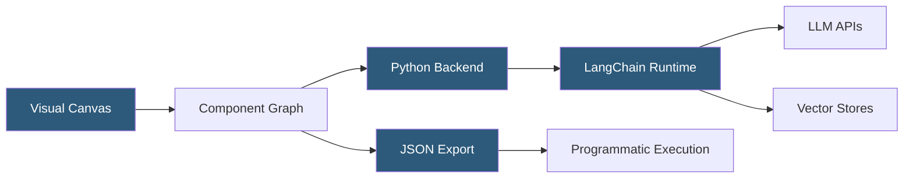

**Category:** AI Workflow & Orchestration Tools
**Difficulty:** Intermediate
**Reading time:** 6 min read

---

Langflow is an open-source visual development environment for building LangChain and LlamaIndex applications. It provides a React Flow-based canvas for constructing complex AI pipelines through component composition, with support for custom Python code injection at any node, bridging the gap between visual and code-based development.

- **Flow** — a directed graph of connected components representing an AI pipeline saved as a JSON file
- **Component** — the Langflow abstraction wrapping a LangChain or LlamaIndex class as a draggable canvas node
- **Custom component** — a user-written Python class extending Langflow's base component class, enabling arbitrary logic within the visual canvas
- **Prompt template** — configurable text template with variable placeholders, editable inline within the node configuration
- **Vector store** — node type wrapping supported vector databases (Chroma, FAISS, Pinecone, Weaviate) for embedding storage and retrieval
- **JSON export** — flows can be exported as JSON files for version control, sharing, or programmatic execution
- **Langflow Cloud** — hosted version of Langflow providing deployment and execution infrastructure

Langflow's architecture differs from Flowise in a key way: it is Python-based (FastAPI backend) rather than Node.js, making it easier to integrate with the Python ML ecosystem and contribute custom components in Python. The backend serves the React Flow frontend and executes flows when triggered through the UI or API.

Each component in Langflow is a Python class annotated with `@component` decorator metadata declaring its display name, description, input types, and output types. The frontend uses this metadata to render the node with appropriate configuration controls. Creating a custom component requires writing a Python class extending `CustomComponent` and implementing an `build()` method that returns a LangChain object.

This extensibility is Langflow's core advantage: any LangChain-compatible Python code can become a Langflow node, enabling advanced users to integrate custom embedding models, proprietary data connectors, or specialized processing logic within the visual workflow.

Prompt templates in Langflow render as richly editable text areas within the node configuration, with variable placeholders highlighted. Template variables appear as additional input handles on the node, enabling dynamic prompt construction by connecting upstream node outputs to template variable inputs.

The flow execution API accepts a flow ID and a set of input values, returning the final output. This enables production integration: a deployed Langflow instance serves flows as REST endpoints, allowing external applications to invoke AI pipelines without embedding LangChain dependencies.

Langflow Cloud provides hosted deployment with authentication, team collaboration, and usage monitoring, reducing the infrastructure burden for teams wanting to use Langflow without self-hosting.

- Prototyping a document QA pipeline with custom PDF parsing logic using a Python custom component
- Building a multi-model comparison workflow routing the same prompt through different LLMs and comparing responses
- Creating a LangChain agent with proprietary tool integrations encapsulated as custom components
- Exporting flows as JSON for version control in Git alongside application code
- Enabling data scientists to build and test LangChain pipelines without a full development environment setup

| Advantage | Disadvantage |
|-----------|--------------|
| Python-native custom components enable arbitrary LangChain integration | Steeper learning curve than Flowise for custom component development requiring Python class authoring |
| JSON flow export enables version control and programmatic manipulation | Self-hosting requires Python environment setup and dependency management |
| Visual representation aids understanding of complex multi-step pipeline architecture | Debugging failures in visually complex flows requires interpreting Python stack traces |
| Direct LangChain/LlamaIndex compatibility ensures access to latest ecosystem components | Visual-code hybrid approach means some optimizations available in pure code are inaccessible |

- [Langflow Component Customization](langflow-component-customization.md)
- [Flowise Low-Code LLM Apps](flowise-low-code-llm-apps.md)
- [Dify.ai LLM App Development](dify-ai-llm-app-development.md)

---
*Part of the [AI Workflow & Orchestration Tools](index.md) category · [Back to Master Index](../../index.md)*
