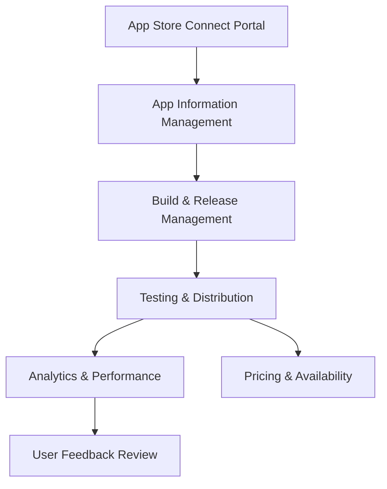

**Category:** App Store & Marketplace Platforms
**Difficulty:** Intermediate
**Reading time:** 6 min read

---

App Store Connect is Apple's platform for managing app submissions, monitoring analytics, configuring pricing and distribution, and communicating with users. Mastering App Store Connect is essential for any developer releasing applications on Apple's platforms.

- **App metadata management** — updating descriptions, screenshots, and localization
- **Build management** — organizing and selecting builds for review and release
- **Analytics dashboard** — tracking downloads, revenue, crashes, and user engagement
- **User management** — controlling team member access and roles
- **Version release scheduling** — coordinating rollout timing across regions

App Store Connect serves as the central hub for managing all aspects of an app's lifecycle on Apple platforms. The platform allows developers to upload app metadata including detailed descriptions, promotional text, keywords, screenshots, and app previews for each supported language. Build management features let developers organize multiple versions, set which build is used for testing versus production, and manage version numbers and release notes. The analytics dashboard provides real-time insights into app performance including daily and monthly active users, downloads, revenue, and user engagement metrics. Developers can also view crash reports and performance issues reported by users. The pricing and availability section controls in which countries the app is sold, pricing tiers, promotional pricing, and free trial periods. User management features allow developers to invite team members with specific roles like marketing, developer, or financial contact. Version management controls enable scheduling phased releases or limiting availability to specific regions during testing phases.

- Publishing app updates with new features and bug fixes
- Analyzing user engagement and retention metrics
- Managing localization for multiple languages and regions
- Coordinating team access for large development organizations
- Monitoring crash reports and prioritizing stability improvements

| Advantage | Disadvantage |
|-----------|--------------|
| Comprehensive analytics for decision-making | Complex interface with many features |
| Real-time visibility into app performance | Data delays can affect decision-making |
| Centralized team management | Learning curve for new users |
| Detailed localization support | Requires attention to metadata quality |
| Financial reporting integration | Policy compliance overhead |

- [Apple App Store Submission Process](apple-app-store-submission-process.md)
- [App Store Review Guidelines](app-store-review-guidelines.md)
- [App Store In-App Purchases (IAP)](app-store-in-app-purchases-iap.md)

---
*Part of the [App Store & Marketplace Platforms](index.md) category · [Back to Master Index](../../index.md)*
