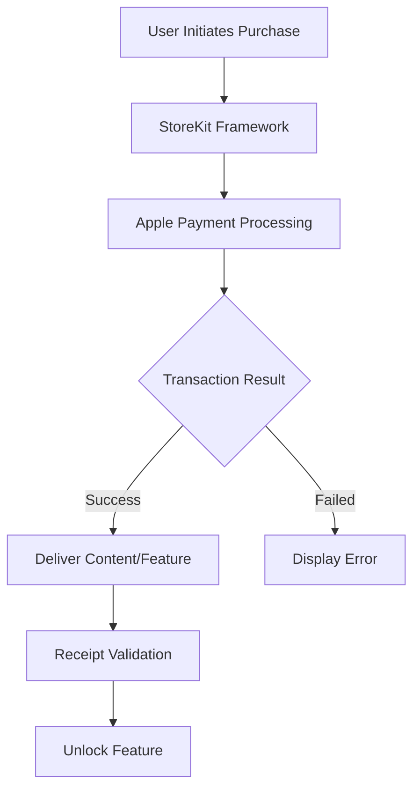

**Category:** App Store & Marketplace Platforms
**Difficulty:** Intermediate
**Reading time:** 6 min read

---

In-App Purchases (IAP) enable users to buy digital content and features within an iOS app using their Apple ID and payment method. IAP is the standard monetization mechanism for free and freemium apps on the Apple App Store.

- **Consumable purchases** — items used up and can be repurchased (coins, energy, unlocks)
- **Non-consumable purchases** — permanent unlocks that cannot be repurchased
- **Subscriptions** — recurring billing for ongoing access to features or content
- **Auto-renewable subscriptions** — subscriptions that automatically renew unless canceled
- **Subscription groups** — organizing related subscriptions to prevent multiple active subscriptions

In-App Purchases are managed through Apple's StoreKit framework, which handles payment processing, receipt generation, and subscription management. When users initiate a purchase within an app, the request is sent to Apple's payment servers using the user's stored payment method. Apple processes the payment and returns a signed receipt confirming the purchase. The app must validate this receipt by decoding it and verifying Apple's signature—this is critical to prevent fraudulent purchases. For consumable purchases like coins or power-ups, the app delivers the item and counts usage. For non-consumable purchases like feature unlocks, the app can check the user's purchase history to restore access if they reinstall the app. Subscriptions are managed automatically by Apple; the payment is renewed periodically, and the receipt is updated to reflect the new expiration date. Developers receive 70% of the purchase price after Apple takes its 30% commission. Understanding receipt validation, subscription lifecycle events, and renewal handling is essential for reliable IAP implementation.

- Offering premium features in a free app via non-consumable purchases
- Implementing virtual currency systems with consumable purchases
- Providing recurring content access through auto-renewable subscriptions
- Creating tiered subscription options with free trials
- Monetizing free-to-play games with cosmetic purchases

| Advantage | Disadvantage |
|-----------|--------------|
| Apple handles all payment processing | Apple takes 30% commission |
| Users have single iTunes login | Limited pricing flexibility |
| Built-in receipt validation security | Requires StoreKit integration |
| Automatic subscription renewal | Subscription refund policies are strict |
| Good user trust due to Apple brand | Users may resist in-app purchases |

- [StoreKit 2 Framework](storekit-2-framework.md)
- [App Store Subscriptions](app-store-subscriptions.md)
- [App Store Monetization Strategies](app-store-monetization-strategies.md)

---
*Part of the [App Store & Marketplace Platforms](index.md) category · [Back to Master Index](../../index.md)*
