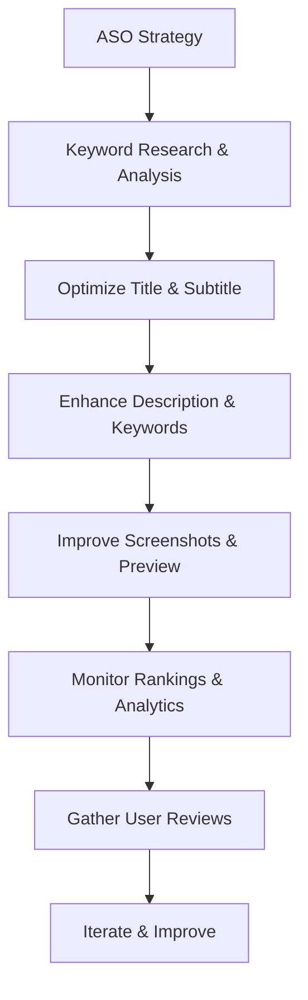

**Category:** App Store & Marketplace Platforms
**Difficulty:** Intermediate
**Reading time:** 6 min read

---

App Store Optimization (ASO) is the practice of optimizing app visibility and discoverability in app store search results and category rankings. Similar to SEO for websites, ASO helps apps reach more potential users by improving store ranking positions.

- **Keyword research** — identifying high-volume, relevant search terms users employ
- **Title optimization** — incorporating keywords in app titles for improved discoverability
- **Description clarity** — writing compelling descriptions that convert visitors to downloads
- **Screenshot effectiveness** — using visuals to communicate app value and features
- **Rating and review management** — maintaining high ratings and responding to user feedback

ASO begins with keyword research to identify terms potential users search for in the app store. Developers analyze search volume, competition, and relevance to select keywords that provide good opportunities for ranking. These keywords are strategically placed in the app title, subtitle, and keyword field to signal relevance to app store algorithms. The description is crafted to communicate value proposition, key features, and differentiation while naturally incorporating keywords. Screenshot selection is optimized to showcase the most compelling features that drive conversion—users decide whether to download primarily based on screenshots. App store algorithms rank apps based on keyword relevance, download velocity, ratings, and user engagement metrics. Developers monitor ranking positions for target keywords and adjust metadata if rankings drop. Reviews and ratings significantly impact visibility, so maintaining high ratings through quality and user support is important. A/B testing different screenshots, descriptions, and keywords helps identify what resonates most with target audiences.

- Launching new apps with optimized metadata to maximize initial downloads
- Improving visibility for existing apps that rank poorly for target keywords
- Researching competitor keyword strategies and identifying gaps
- Localizing apps for different markets with region-specific keywords
- Monitoring keyword rankings and responding to algorithm changes

| Advantage | Disadvantage |
|-----------|--------------|
| Low-cost visibility improvement | Requires research and testing |
| Ongoing optimization maintains visibility | Algorithm changes can impact strategy |
| Applicable across platforms | Depends on quality app experience |
| Data-driven approach improves decision-making | Competitive keywords are harder to rank for |
| Complements other marketing efforts | Effects may take weeks to manifest |

- [App Store Connect Management](app-store-connect-management.md)
- [App Store Search Ads](app-store-search-ads.md)
- [App Screenshots and Previews](app-screenshots-and-previews.md)

---
*Part of the [App Store & Marketplace Platforms](index.md) category · [Back to Master Index](../../index.md)*
