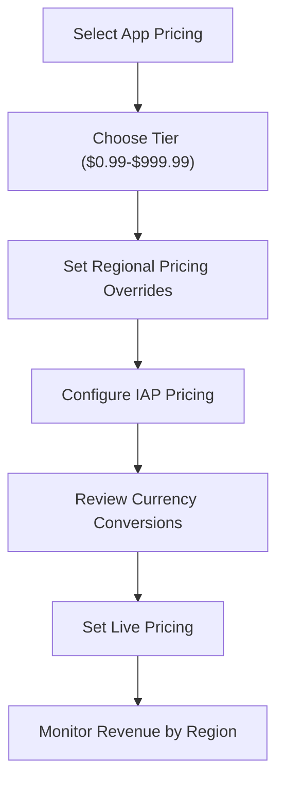

**Category:** App Store & Marketplace Platforms
**Difficulty:** Intermediate
**Reading time:** 6 min read

---

App Store pricing tiers define the price points available for paid apps, in-app purchases, and subscriptions. Apple provides standardized pricing tiers that developers select to set their app or content prices across different currencies and markets.

- **Standard pricing tiers** — Apple-defined price points from $0.99 to $999.99
- **Currency conversion** — automatic pricing adjustment across different currencies
- **Regional pricing** — ability to set specific prices for certain countries
- **Volume licensing** — special pricing for educational or enterprise bulk purchases
- **Introductory pricing** — temporary discounted prices for first-time subscribers

Apple provides predefined pricing tiers that serve as standard options for developers. These tiers, ranging from $0.99 to $999.99, are standardized across the App Store to simplify pricing for users and developers. When a developer selects a tier, Apple automatically calculates equivalent prices in all supported currencies, handling currency conversion and local tax considerations. Developers can override the standard regional prices if desired, setting specific prices for particular countries to account for market conditions or purchasing power differences. For in-app purchases and subscriptions, pricing tiers are also predefined, though developers can use custom pricing for specific promotional offers. Introductory pricing for subscriptions allows developers to offer the first billing cycle at a reduced rate (or free) to encourage subscription adoption. Volume licensing programs provide special pricing for educational institutions and enterprise customers. Regional pricing considerations are important—prices that work well in developed markets may be too high for emerging markets, so many developers set lower prices in those regions while charging more in markets where spending power is higher.

- Setting initial pricing for a new paid app launch
- Adjusting regional prices to account for market conditions
- Offering introductory pricing for new subscription launches
- Analyzing revenue by pricing tier to optimize monetization
- Managing promotional pricing during special sales events

| Advantage | Disadvantage |
|-----------|--------------|
| Standardized tiers simplify pricing | Less flexibility than custom pricing |
| Automatic currency conversion | Currency fluctuations affect real earnings |
| Regional pricing options available | Competition often drives prices down |
| Transparent pricing structure | Changing prices can confuse users |
| Proven pricing points | Optimization requires experimentation |

- [App Store Subscriptions](app-store-subscriptions.md)
- [App Store In-App Purchases (IAP)](app-store-in-app-purchases-iap.md)
- [App Store Monetization Strategies](app-store-monetization-strategies.md)

---
*Part of the [App Store & Marketplace Platforms](index.md) category · [Back to Master Index](../../index.md)*
