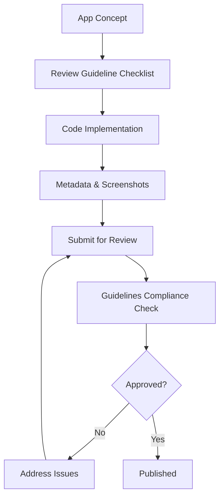

**Category:** App Store & Marketplace Platforms
**Difficulty:** Intermediate
**Reading time:** 6 min read

---

Apple's App Store Review Guidelines establish rules for content, functionality, and behavior that all apps must follow for approval. Understanding these guidelines is critical for developers to avoid rejections and ensure compliance throughout their app's lifecycle.

- **Content standards** — rules about inappropriate content, violence, and adult materials
- **Functionality requirements** — what apps can and cannot do with device features
- **Design consistency** — expectations for UI/UX patterns and platform compliance
- **Performance standards** — requirements for stability, responsiveness, and resource usage
- **Business model restrictions** — rules about pricing, in-app purchases, and advertising

Apple's Review Guidelines cover multiple categories addressing different aspects of app development and behavior. Content guidelines restrict apps from including violence, profanity, hate speech, illegal activities, or other objectionable material. Functionality guidelines specify that apps must fully utilize their stated features, not be misleading about capabilities, and use system features appropriately. Apps must respect user privacy by obtaining proper permissions and not collecting data deceptively. Business guidelines require clear and honest pricing, proper disclosure of subscription terms, and correct use of in-app purchase mechanisms. Design guidelines encourage compliance with iOS design patterns and terminology. Performance guidelines require apps to be stable, respond to user input within reasonable times, and not excessively consume battery or data. Age-rating classifications require developers to self-assess content and select appropriate age ratings. When reviewers assess an app, they check it against these categories to determine if it meets standards for the App Store.

- Verifying app concept compliance before development
- Updating apps to address new guideline requirements
- Resolving review rejections by understanding violations
- Designing in-app purchase experiences that comply with policies
- Ensuring parental control compliance for apps targeting children

| Advantage | Disadvantage |
|-----------|--------------|
| Protects users from malicious or inappropriate apps | Restricts some legitimate functionality |
| Creates consistent, predictable platform | Guidelines can be subjective |
| Encourages good user experience design | Changes to guidelines can require app updates |
| Ensures data privacy and security | May limit innovative app concepts |
| Protects Apple's brand reputation | Appeals process can be slow |

- [Apple App Store Submission Process](apple-app-store-submission-process.md)
- [App Store Connect Management](app-store-connect-management.md)
- [App Privacy Labels](app-privacy-labels.md)

---
*Part of the [App Store & Marketplace Platforms](index.md) category · [Back to Master Index](../../index.md)*
