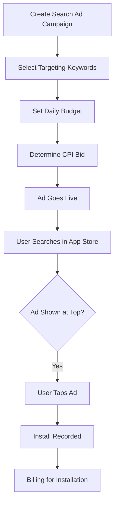

**Category:** App Store & Marketplace Platforms
**Difficulty:** Intermediate
**Reading time:** 6 min read

---

App Store Search Ads allow developers to promote their apps prominently in the App Store search results. These paid ads appear at the top of relevant search result pages, driving visibility and app downloads from users actively searching for similar apps.

- **Search-based targeting** — ads shown for specific keywords users search
- **Cost-per-install (CPI) bidding** — paying only when users tap the ad and install
- **Campaign management** — organizing ad campaigns by app or promotional goals
- **Keyword selection** — choosing relevant terms to bid on for targeting
- **Search term report** — analyzing which searches drove installs and their ROI

App Store Search Ads operate on a cost-per-install basis where developers bid on keywords relevant to their app. When users search the App Store, if a developer's bid wins the auction for that search term, their app appears as a sponsored result at the top of search results. The developer pays only when a user taps the ad and begins installing the app; impressions (showing the ad) don't incur charges. Developers set daily budgets, and the system optimizes to spend that budget throughout the day. Bidding can be automatic (Apple sets bids to achieve installs within the budget) or manual (developers set specific CPI bids). The campaign dashboard shows which search terms are driving installs, what the cost per install is, and overall return on ad spend. High-performing keywords can have bids increased to get more visibility, while underperforming keywords can be paused or have bids reduced. Search Ads are particularly effective for discoverable keywords related to the app's function and work best for apps with clear value propositions that resonate with users searching for solutions.

- Promoting new app launches to drive initial installs
- Expanding visibility for apps that rank poorly organically
- Testing marketing messages and positioning with different keywords
- Driving short-term install spikes for product releases
- Capturing high-intent users actively searching for solutions

| Advantage | Disadvantage |
|-----------|--------------|
| High-intent user targeting | Can be expensive per install |
| Only pay for actual installations | Requires ongoing campaign management |
| Detailed performance metrics | Works best for discoverable categories |
| Complements organic rankings | Reduces profit margin on purchases |
| Real-time bidding optimization | Competitive keywords have high costs |

- [App Store Optimization (ASO)](app-store-optimization-aso.md)
- [App Store Connect Management](app-store-connect-management.md)
- [App Store Monetization Strategies](app-store-monetization-strategies.md)

---
*Part of the [App Store & Marketplace Platforms](index.md) category · [Back to Master Index](../../index.md)*
