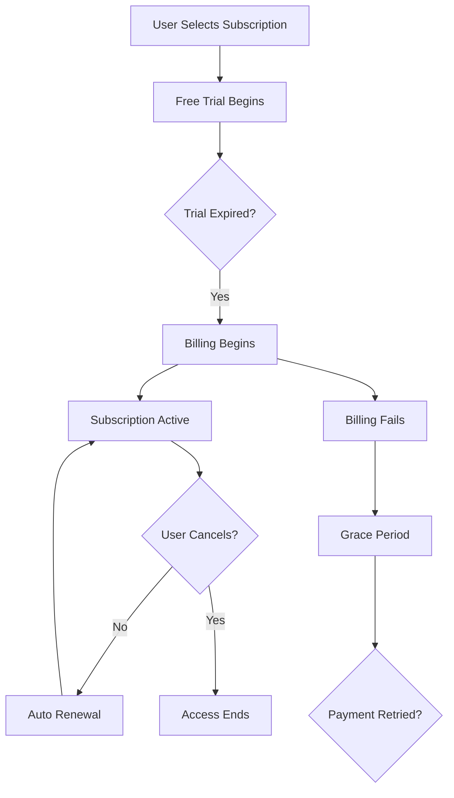

**Category:** App Store & Marketplace Platforms
**Difficulty:** Intermediate
**Reading time:** 6 min read

---

App Store Subscriptions enable developers to offer recurring billing models for content, features, or services. Subscriptions provide predictable recurring revenue while creating ongoing user relationships and are increasingly important for modern app monetization.

- **Auto-renewable subscriptions** — recurring billing that renews automatically unless canceled
- **Subscription tiers** — multiple subscription options at different price points
- **Free trials** — introductory periods before charging begins
- **Grace periods** — extended windows for payment retry if billing fails
- **Win-back offers** — discounted pricing to re-engage lapsed subscribers

App Store subscriptions operate on a renewable model where Apple charges users at regular intervals unless they cancel. Developers configure subscription products in App Store Connect specifying the billing cycle (weekly, monthly, yearly), price, and trial length. When users purchase a subscription, they can optionally enter a free trial period where they gain access but aren't charged. At the end of the trial or subscription period, Apple automatically charges the user's payment method. If a payment fails, Apple enters a grace period where the user retains access while Apple retries payment multiple times over several days. Developers can access subscription information through App Store Server API and can issue promotional offers or win-back offers to modify pricing for specific users. The system tracks subscription status including active, expired, canceled, and suspended states. Developers must handle subscription lifecycle events including start, renewal, cancellation, and refund requests. Apple's refund policy allows users to request refunds for the most recent subscription, which developers can approve or decline through App Store Connect.

- Publishing paid news or magazine content with subscriptions
- Offering premium features in productivity or fitness apps
- Providing streaming content with tiered subscription plans
- Creating professional tool subscriptions with annual billing
- Building community apps with premium membership tiers

| Advantage | Disadvantage |
|-----------|--------------|
| Predictable recurring revenue | Requires ongoing content updates |
| Builds long-term customer relationships | Customer acquisition costs are higher |
| Multiple pricing tiers available | Churn management is critical |
| Apple handles billing and fraud | 30% Apple commission impacts margins |
| Free trials reduce purchase friction | Users can easily cancel anytime |

- [StoreKit 2 Framework](storekit-2-framework.md)
- [App Store In-App Purchases (IAP)](app-store-in-app-purchases-iap.md)
- [Subscription App Revenue](subscription-app-revenue.md)

---
*Part of the [App Store & Marketplace Platforms](index.md) category · [Back to Master Index](../../index.md)*
