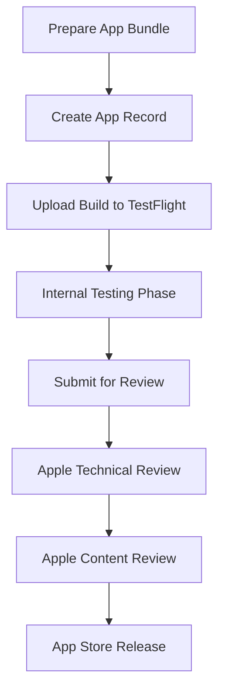

**Category:** App Store & Marketplace Platforms
**Difficulty:** Intermediate
**Reading time:** 6 min read

---

The Apple App Store submission process is a structured workflow that guides developers through app registration, technical validation, content review, and publication. Understanding this process is essential for developers seeking to distribute iOS, macOS, tvOS, or watchOS applications.

- **App registration** — creating app records in App Store Connect with metadata
- **Build submission** — uploading compiled application binaries for review
- **Automated validation** — Apple's technical checks for crashes, compatibility, and functionality
- **Review guidelines compliance** — ensuring app meets Apple's content and behavior standards
- **Release management** — coordinating app availability across testing and production tracks

The App Store submission process begins by creating an app record in App Store Connect with detailed metadata including app description, screenshots, keywords, and pricing information. Developers then compile their application into an app bundle with proper code signing and entitlements. The build is uploaded to TestFlight first for internal testing and validation. Once ready for public release, developers submit the build for official App Store review. Apple performs automated technical validation checking for crashes, proper use of APIs, privacy violations, and security issues. Qualified human reviewers then perform content review against Apple's guidelines, checking for inappropriate content, misleading descriptions, and adherence to design standards. The review process typically takes 24-48 hours. Once approved, the app can be released immediately or scheduled for a future date. Rejected apps receive detailed feedback explaining why they were rejected, allowing developers to address issues and resubmit.

- Initial launch of new iOS application to the App Store
- Publishing major feature updates requiring code review
- Testing app functionality across iOS versions before release
- Managing app availability across different geographic regions
- Handling app rejection and resubmission cycles

| Advantage | Disadvantage |
|-----------|--------------|
| Curated user base with high purchasing power | Lengthy review times can delay launches |
| Apple's technical validation ensures quality | Strict guidelines limit certain functionality |
| Consistent user experience across devices | No alternative distribution channels on iOS |
| Regular app compatibility testing | Rejections can be subjective |
| Fraud prevention benefits users and developers | Requires Apple Developer Program membership |

- [App Store Connect Management](app-store-connect-management.md)
- [App Store Review Guidelines](app-store-review-guidelines.md)
- [TestFlight Beta Distribution](testflight-beta-distribution.md)

---
*Part of the [App Store & Marketplace Platforms](index.md) category · [Back to Master Index](../../index.md)*
