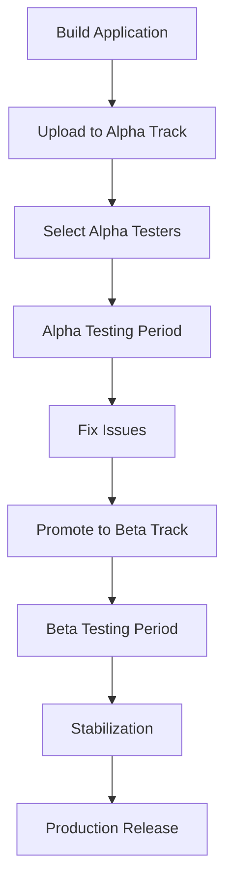

**Category:** App Store & Marketplace Platforms
**Difficulty:** Intermediate
**Reading time:** 6 min read

---

Closed testing tracks on Google Play allow developers to release app builds to a limited group of testers before wider public release. This provides controlled testing with feedback before production deployment.

- **Alpha track** — earliest testing stage with smallest user base
- **Beta track** — broader testing before production release
- **Tester management** — defining which users have access to testing builds
- **Gradual rollout** — expanding tester base as app stabilizes
- **Review requirements** — understanding review process for test builds

Google Play provides two testing tracks: Alpha and Beta. Developers upload builds to the Alpha track first, which is the earliest stage of testing. They select a list of testers via Google Groups, email addresses, or links. Alpha builds can have a smaller number of testers (starting with internal team members). Once the app is more stable, developers graduate to the Beta track with a larger test group. Beta builds go through Play Store review but are not publicly listed—only tester access is available. Testers access builds through a special link that gives them access to the test version while also allowing them to leave reviews. Developers can expand the tester base gradually as stability improves. Analytics show crash reports and performance issues specific to the test user group. Users can opt-out of testing at any time, reverting to the production version if installed. Pre-launch reports provide simulation of how the app might perform on different device/OS combinations.

- Testing major feature releases with limited group before public launch
- Validating app stability across device types
- Gathering feedback from engaged testers
- Coordinating phased rollouts to manage risk
- Testing subscription and IAP functionality

| Advantage | Disadvantage |
|-----------|--------------|
| Controlled testing before public release | Limited tester availability can restrict scope |
| Feedback from diverse devices/OS versions | Still requires app store review |
| Gradual rollout reduces risk | Managing tester groups adds overhead |
| Analytics from test group | Testers may not represent real users |
| Can revert to production if issues arise | Testing timeline can delay releases |

- [Open Testing (Beta) Programs](open-testing-beta-programs.md)
- [Internal App Sharing](internal-app-sharing.md)
- [Production Release Management](production-release-management.md)

---
*Part of the [App Store & Marketplace Platforms](index.md) category · [Back to Master Index](../../index.md)*
