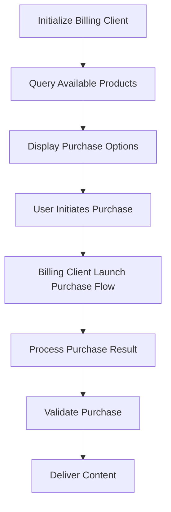

**Category:** App Store & Marketplace Platforms
**Difficulty:** Intermediate
**Reading time:** 6 min read

---

Google Play Billing Library is the official SDK for integrating in-app purchases and subscriptions into Android applications. It handles payment processing, subscription lifecycle management, and receipt validation.

- **Billing Client** — the main library interface for purchase operations
- **SKU types** — distinguishing between consumable, non-consumable, and subscription products
- **Purchase state** — tracking whether purchases are pending, purchased, or acknowledged
- **Subscription management** — handling subscription lifecycle including renewal and cancellation
- **Deferred billing** — delaying payment for subscription upgrades

Google Play Billing Library provides a PurchasesUpdatedListener that receives callbacks when purchases complete. Developers initialize a BillingClient at app startup, connecting to Google Play services. When ready to display products, they call queryProductDetailsAsync() to retrieve current pricing, descriptions, and product IDs. When a user decides to purchase, the app calls launchBillingFlow() which launches the Google Play payment UI. After the user completes payment, the library calls the listener with the PurchaseResult. The app must acknowledge purchases within 3 days or Google Play will refund them automatically. For subscriptions, the library tracks renewal dates, subscription status changes, and expiration events. The library handles complex scenarios like subscription upgrades (potentially with proration), downgrades, and billing retry for failed payments. Developers can validate purchases server-side using Google Play's Server API for additional security. The library abstracts away the complexity of managing purchase states, handling acknowledgment requirements, and managing subscription lifecycles.

- Implementing in-app purchases in new Android applications
- Managing subscription products with automatic renewal
- Upgrading and downgrading subscription tiers
- Handling failed payments and retry logic
- Migrating from older billing libraries to current version

| Advantage | Disadvantage |
|-----------|--------------|
| Official library ensures compatibility | Google takes 30% commission |
| Handles complex subscription logic | Requires server-side validation |
| Regular updates and improvements | Learning curve for new developers |
| Comprehensive payment scenarios | Debugging can be challenging |
| Good documentation available | Tied to Google Play services |

- [Play Store In-App Purchases](play-store-in-app-purchases.md)
- [Play Store Subscriptions](play-store-subscriptions.md)
- [Google Play Store Publishing](google-play-store-publishing.md)

---
*Part of the [App Store & Marketplace Platforms](index.md) category · [Back to Master Index](../../index.md)*
