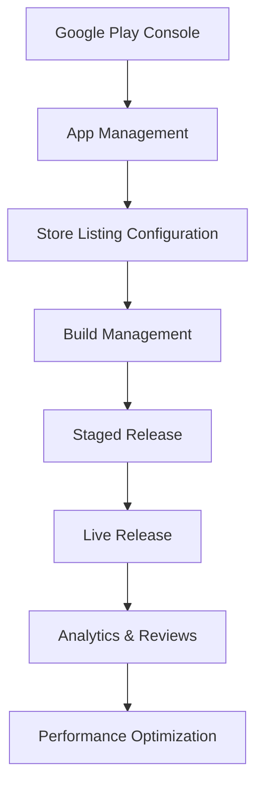

**Category:** App Store & Marketplace Platforms
**Difficulty:** Intermediate
**Reading time:** 6 min read

---

Google Play Console is Google's comprehensive platform for publishing apps, managing releases, monitoring analytics, and responding to user reviews. It serves as the central hub for Google Play Store presence and performance tracking.

- **App management** — creating and configuring app store listings
- **Release management** — deploying builds and managing version releases
- **Analytics dashboard** — tracking installs, ratings, and user engagement
- **User reviews** — viewing and responding to app store reviews
- **Policy compliance** — ensuring adherence to Google Play policies
- **Team management** — controlling access for team members

Google Play Console provides a unified dashboard for managing all aspects of app publishing. In the App Management section, developers create app entries, configure app details, and manage multiple apps from a single account. The Release section handles APK and AAB uploads, version management, and coordinating between different testing tracks (alpha, beta) and production release. The Store Listing section allows customization of app descriptions, screenshots, promotional graphics, and content rating questionnaires. The Analytics section provides detailed insights into user acquisition, retention, revenue, and device/OS breakdown. The User Reviews section aggregates all reviews and ratings, allowing developers to respond to user feedback publicly. The Policy section shows compliance status and any warnings about policy violations. Developers can manage team members with granular permissions including developer, marketing, analyst, tester, and financial contact roles. The Console also provides access to pre-launch reports showing how apps perform on devices before public release.

- Publishing and updating Android apps across different release tracks
- Monitoring app rating and user sentiment through reviews
- Analyzing user demographics and engagement patterns
- Managing team collaboration and access permissions
- Handling policy violations and compliance issues
- Testing app behavior across device configurations

| Advantage | Disadvantage |
|-----------|--------------|
| Comprehensive analytics and insights | Complex interface with many features |
| Direct team collaboration and permissions | Steep learning curve for new users |
| Real-time data on user engagement | Data delays can affect decisions |
| Visibility into user feedback | Managing thousands of reviews requires effort |
| Staged rollout capabilities | Policy changes can require app updates |

- [Google Play Store Publishing](google-play-store-publishing.md)
- [Play Store Listing Optimization](play-store-listing-optimization.md)
- [Play Store In-App Purchases](play-store-in-app-purchases.md)

---
*Part of the [App Store & Marketplace Platforms](index.md) category · [Back to Master Index](../../index.md)*
