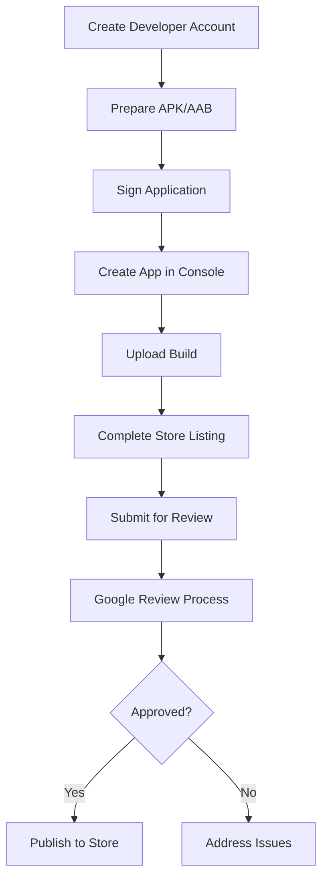

**Category:** App Store & Marketplace Platforms
**Difficulty:** Intermediate
**Reading time:** 6 min read

---

Google Play Store publishing is the process of releasing Android apps to the largest mobile app distribution platform. Understanding the submission process, review guidelines, and platform capabilities is essential for Android developers.

- **Developer registration** — creating and verifying a Google Play Developer account
- **App signing** — cryptographically signing apps with a keystore before submission
- **Play Console access** — managing app releases through Google Play Console
- **Staged rollout** — gradually releasing apps to percentages of users
- **Review process** — Google's automated and manual review of apps before publication

To publish on Google Play, developers first create a Google Play Developer account, paying a one-time $25 registration fee. Apps are uploaded as AAB (Android App Bundle) files, which contain all resources and optimizations for different device configurations. Before uploading, the app must be signed with a cryptographic key from the developer's keystore—Google uses this signing key to verify app authenticity on updates. In Google Play Console, developers create an app entry, configure store listing details including description, screenshots, and category, and upload the signed AAB. Once submitted, Google's automated systems scan for policy violations, malware, and security issues. The app then enters a manual review queue where human reviewers check compliance with Google's policy guidelines. The review process typically takes 2-4 hours but can take longer during peak times. Apps with policy violations receive detailed feedback explaining the issues. Once approved, developers can choose to publish immediately, schedule a future release, or do a staged rollout starting with a small percentage of users and gradually expanding to 100%.

- Publishing new Android apps to reach Google Play's 2+ billion users
- Handling app rejections and resubmitting after policy compliance
- Managing update releases and phased rollouts
- Monitoring user feedback and ratings on Play Store
- Testing beta releases through Google Play's internal testing track

| Advantage | Disadvantage |
|-----------|--------------|
| Access to largest Android app store | Policy compliance requirements |
| Less strict review than Apple | Longer review times possible |
| Staged rollout reduces risk | User base less affluent than iOS |
| Multiple monetization options | More fragmented device landscape |
| Larger potential user base | Higher frequency of problematic apps |

- [Google Play Console](google-play-console.md)
- [Play Store Listing Optimization](play-store-listing-optimization.md)
- [Play Store In-App Purchases](play-store-in-app-purchases.md)

---
*Part of the [App Store & Marketplace Platforms](index.md) category · [Back to Master Index](../../index.md)*
